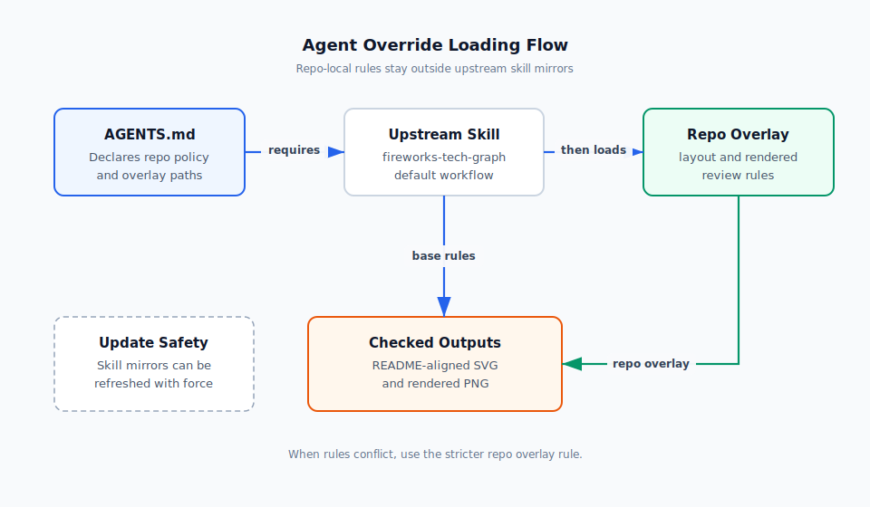

# Agent 覆盖规则

这个目录存放当前仓库的 agent overlay 规则。它们用于补充或收紧上游 skill 的默认行为，避免把本地约束写进可能被 `skills add --force` 覆盖的 skill 镜像目录。

## 使用方式

- 先按 `AGENTS.md` 判断是否需要调用某个 skill。
- 读取目标 skill 的 `SKILL.md`，理解上游默认工作流和输出要求。
- 如果 `AGENTS.md` 指向本目录中的 overlay 文件，在执行该 skill 前继续读取 overlay。
- 当 overlay 和上游 skill 规则冲突时，优先采用更严格、更贴近当前仓库需求的规则。

## 文件约定

- overlay 文件按 `<target>-<topic>-rules.md` 命名。
- 文件内容应只描述当前仓库的局部约束，不复制整个上游 skill。
- 上游 skill 更新后，优先检查 overlay 是否仍然需要保留或调整。

## 当前规则

- `fireworks-tech-graph-layout-rules.md`：技术图的布局、连接线、标签、导出和渲染检查规则。
