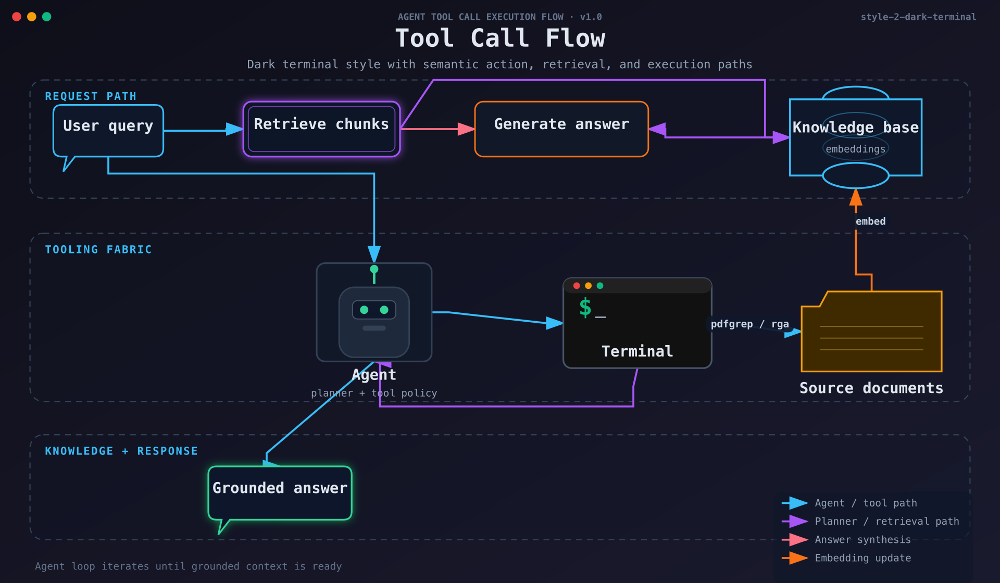
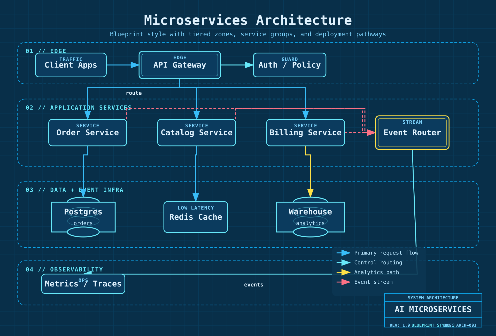
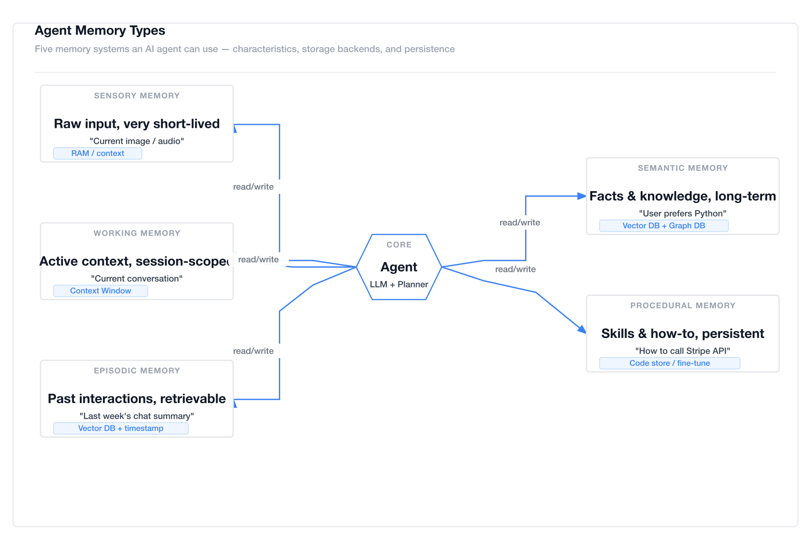
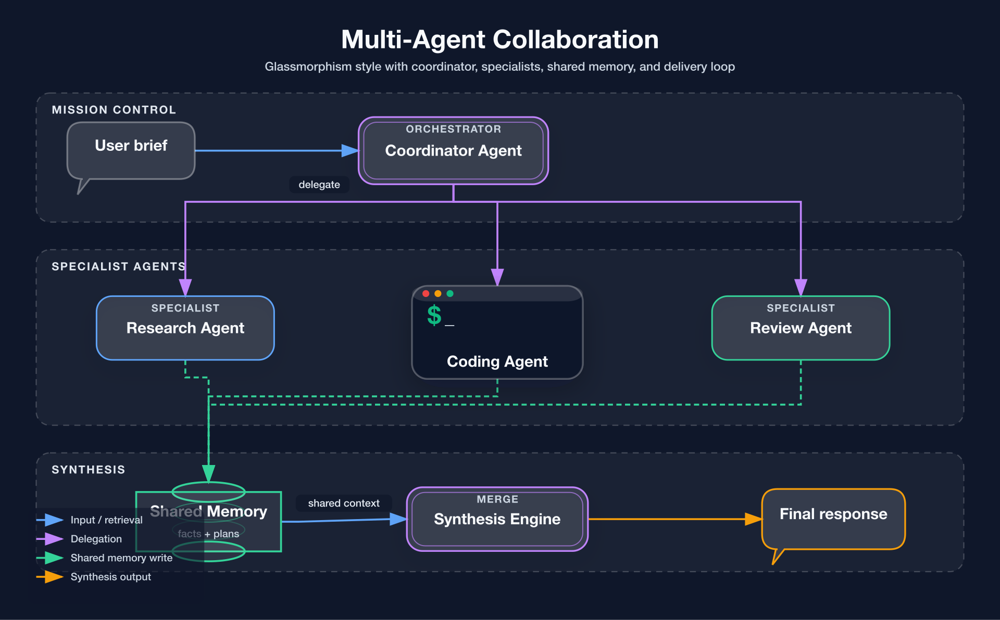
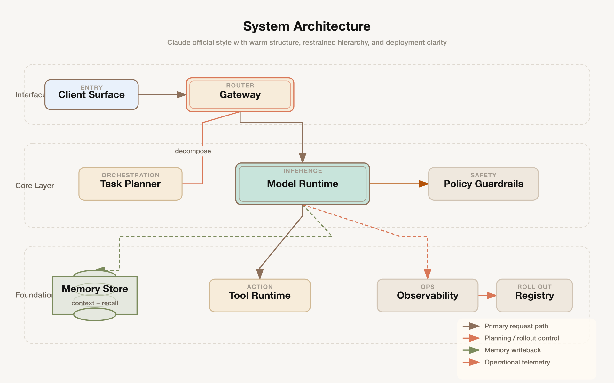
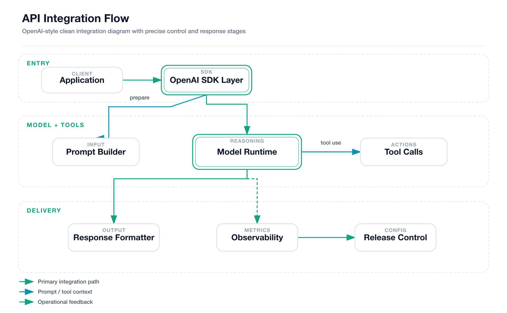

[English](README.md) | [中文](README.zh.md)

# fireworks-tech-graph

> **Stop drawing diagrams by hand.** Describe your system in English or Chinese — get publication-ready SVG + PNG technical diagrams in seconds.

[](LICENSE)
[](https://claude.ai/code)
[]()
[]()
[]()

---

## Overview

`fireworks-tech-graph` turns natural language descriptions into polished SVG diagrams, then exports them as high-resolution PNG via `rsvg-convert`. It ships with **7 visual styles** and deep knowledge of AI/Agent domain patterns (RAG, Agentic Search, Mem0, Multi-Agent, Tool Call flows), plus full support for all 14 UML diagram types.

```
User: "Generate a Mem0 memory architecture diagram, dark style"
  → Skill classifies: Memory Architecture Diagram, Style 2
  → Generates SVG with swim lanes, cylinders, semantic arrows
  → Exports 1920px PNG
  → Reports: mem0-architecture.svg / mem0-architecture.png
```

---

## Showcase

> All samples exported at 1920px width (2× retina) via `rsvg-convert`. PNG is lossless and the right choice for technical diagrams — sharp edges, no JPEG compression artifacts on text/lines.

### Style 1 — Flat Icon (default)
*Mem0 Memory Architecture — white background, semantic arrows, layered memory system*


### Style 2 — Dark Terminal
*Tool Call Flow — dark background, neon accents, monospace font*


### Style 3 — Blueprint
*Microservices Architecture — deep blue background, grid lines, cyan strokes*


### Style 4 — Notion Clean
*Agent Memory Types — minimal white, single accent color*


### Style 5 — Glassmorphism
*Multi-Agent Collaboration — dark gradient background, frosted glass cards*


### Style 6 — Claude Official
*System Architecture — warm cream background (#f8f6f3), Anthropic brand colors, clean professional aesthetic*


### Style 7 — OpenAI Official
*API Integration Flow — pure white background, OpenAI brand palette, modern minimalist design*


---

## Stable Prompt Recipes

Use prompts like these when you want the model to stay close to the repo's strongest regression-tested outputs:

### Style 1 — Flat Icon
```text
Draw a Mem0 memory architecture diagram in style 1 (Flat Icon).
Use four horizontal sections: Input Layer, Memory Manager, Storage Layer, Output / Retrieval.
Include User, AI App / Agent, LLM, mem0 Client, Memory Manager, Vector Store, Graph DB, Key-Value Store, History Store, Context Builder, Ranked Results, Personalized Response.
Use semantic arrows for read, write, control, and data flow. Keep the layout clean and product-doc friendly.
```

### Style 2 — Dark Terminal
```text
Draw a tool call flow diagram in style 2 (Dark Terminal).
Show User query, Retrieve chunks, Generate answer, Knowledge base, Agent, Terminal, Source documents, and Grounded answer.
Use terminal chrome, neon accents, monospace typography, and semantic arrows for retrieval, synthesis, and embedding update.
```

### Style 3 — Blueprint
```text
Draw a microservices architecture diagram in style 3 (Blueprint).
Create numbered engineering sections like 01 // EDGE, 02 // APPLICATION SERVICES, 03 // DATA + EVENT INFRA, 04 // OBSERVABILITY.
Include Client Apps, API Gateway, Auth / Policy, three services, Event Router, Postgres, Redis Cache, Warehouse, and Metrics / Traces.
Use blueprint grid, cyan strokes, and a bottom-right title block.
```

### Style 4 — Notion Clean
```text
Draw an agent memory types diagram in style 4 (Notion Clean).
Compare Sensory Memory, Working Memory, Episodic Memory, Semantic Memory, and Procedural Memory around a central Agent core.
Use a minimal white layout, neutral borders, one accent color for arrows, and short storage tags for each memory type.
```

### Style 5 — Glassmorphism
```text
Draw a multi-agent collaboration diagram in style 5 (Glassmorphism).
Use three sections: Mission Control, Specialist Agents, and Synthesis.
Include User brief, Coordinator Agent, Research Agent, Coding Agent, Review Agent, Shared Memory, Synthesis Engine, and Final response.
Use frosted cards, soft glow, and semantic arrows for delegation, shared memory writes, and synthesis output.
```

### Style 6 — Claude Official
```text
Draw a system architecture diagram in style 6 (Claude Official).
Use left-side layer labels: Interface Layer, Core Layer, Foundation Layer.
Include Client Surface, Gateway, Task Planner, Model Runtime, Policy Guardrails, Memory Store, Tool Runtime, Observability, and Registry.
Use warm cream background, restrained brand-like palette, generous whitespace, and a bottom-right legend.
```

### Style 7 — OpenAI Official
```text
Draw an API integration flow diagram in style 7 (OpenAI Official).
Use three sections: Entry, Model + Tools, and Delivery.
Include Application, OpenAI SDK Layer, Prompt Builder, Model Runtime, Tool Calls, Response Formatter, Observability, and Release Control.
Keep the look minimal, white, precise, and modern with clean green-accented arrows.
```

---

## Features

- **7 visual styles** — from clean white docs to dark neon to frosted glass to official brand styles
- **Executable style system** — style guides are encoded into the generator, not only documented in markdown
- **14 diagram types** — Full UML support (Class, Component, Deployment, Package, Composite Structure, Object, Use Case, Activity, State Machine, Sequence, Communication, Timing, Interaction Overview, ER Diagram) plus AI/Agent domain diagrams
- **AI/Agent domain patterns** — RAG, Agentic Search, Mem0, Multi-Agent, Tool Call, and more built-in
- **Semantic shape vocabulary** — LLM = double-border rect, Agent = hexagon, Vector Store = ringed cylinder
- **Semantic arrow system** — color + dash pattern encode meaning (write vs read vs async vs loop)
- **Product icons** — 40+ products with brand colors: OpenAI, Anthropic, Pinecone, Weaviate, Kafka, PostgreSQL…
- **Swim lane grouping** — automatic layer labeling for complex architectures
- **SVG + PNG output** — SVG for editing, 1920px PNG for embedding
- **rsvg-convert compatible** — no external font fetching, pure inline SVG

---

## Installation

```bash
npx skills add yizhiyanhua-ai/fireworks-tech-graph
```

This skill is installed from the GitHub repository. The npm package page is the public package/distribution page:

```text
https://www.npmjs.com/package/@yizhiyanhua-ai/fireworks-tech-graph
```

Do not use the npm package name with `skills add`, because the CLI resolves install sources as GitHub/local paths.

## Update

```bash
npx skills add yizhiyanhua-ai/fireworks-tech-graph --force -g -y
```

Re-run `add --force` to pull the latest version of this skill.

Or clone directly:

```bash
git clone https://github.com/yizhiyanhua-ai/fireworks-tech-graph.git ~/.claude/skills/fireworks-tech-graph
```

---

## Requirements

```bash
# macOS
brew install librsvg

# Ubuntu/Debian
sudo apt install librsvg2-bin

# Verify
rsvg-convert --version
```

---

## Why Not Mermaid or draw.io?

| | Mermaid | draw.io | **fireworks-tech-graph** |
|--|---------|---------|--------------------------|
| Natural language input | ✗ | ✗ | ✅ |
| AI/Agent domain patterns | ✗ | ✗ | ✅ |
| Multiple visual styles | ✗ | manual | ✅ 5 built-in |
| High-res PNG export | ✗ | manual | ✅ auto 1920px |
| Semantic arrow colors | ✗ | manual | ✅ auto |
| No online tool needed | ✅ | ✗ | ✅ |

Mermaid is great for quick inline diagrams in markdown. draw.io is great for manual polishing. `fireworks-tech-graph` is optimized for **describing a system and getting a polished diagram immediately**, without writing DSL syntax or clicking around a GUI.

---

## Usage

### Trigger phrases

The skill auto-triggers on:

```
generate diagram / draw diagram / create chart / visualize
architecture diagram / flowchart / sequence diagram / data flow
```

### Basic usage

```
Draw a RAG pipeline flowchart
```

```
Generate an Agentic Search architecture diagram
```

### Specify style

```
Draw a microservices architecture diagram, style 2 (dark terminal)
```

```
Draw a multi-agent collaboration diagram --style glassmorphism
```

### Specify output path

```
Generate a Mem0 architecture diagram, output to ~/Desktop/
```

```
Create a tool call flow diagram --output /tmp/diagrams/
```

---

## Example Prompts by Scenario

### AI/Agent Systems

```
Compare Agentic RAG vs standard RAG in a feature matrix, Notion clean style
```
→ Comparison matrix: RAG vs Agentic RAG, covering retrieval strategy, agent loop, tool use

```
Generate a Mem0 memory architecture diagram with vector store, graph DB, KV store, and memory manager
```
→ Memory Architecture with swim lanes: Input → Memory Manager → Storage tiers → Retrieval

```
Draw a Multi-Agent diagram: Orchestrator dispatches 3 SubAgents (search / compute / code execution), results aggregated
```
→ Agent Architecture with hexagons, tool layers, and result aggregation

```
Visualize the Tool Call execution flow: LLM → Tool Selector → Execution → Parser → back to LLM
```
→ Flowchart with decision loop showing tool invocation cycle

```
Draw the 5 agent memory types: Sensory, Working, Episodic, Semantic, Procedural
```
→ Mind map or layered architecture showing memory tiers from sensory to procedural

### Infrastructure & Cloud

```
Draw a microservices architecture: Client → API Gateway → [User Service / Order Service / Payment Service] → PostgreSQL + Redis
```
→ Architecture diagram with horizontal layers, swim lanes per service cluster

```
Generate a data pipeline diagram: Kafka → Spark processing → write to S3 → Athena query
```
→ Data flow diagram with labeled arrows (stream / batch / query)

```
Draw a Kubernetes deployment: Ingress → Service → [Pod × 3] → ConfigMap + PersistentVolume
```
→ Architecture with dashed containers per namespace, solid arrows for traffic flow

### API & Sequence Flows

```
Draw an OAuth2 authorization code flow sequence diagram: User → Client → Auth Server → Resource Server
```
→ Sequence diagram with vertical lifelines and activation boxes

```
Draw the ChatGPT Plugin call sequence diagram
```
→ Sequence: User → ChatGPT → Plugin Manifest → API → Response chain

### Decision & Process Flows

```
Draw a pre-launch QA flowchart for an AI app: Code Review → Security Scan → Performance Test → Manual Approval → Deploy
```
→ Flowchart with diamond decision nodes and parallel branches

```
Generate a feature comparison matrix: RAG vs Fine-tuning vs Prompt Engineering
```
→ Comparison matrix with checked/unchecked cells across cost, latency, accuracy, flexibility

### Concept Maps

```
Visualize the LLM application tech stack: from foundation model to SDK to app framework to deployment
```
→ Layered architecture or mind map from model layer to product layer

```
Draw an AI Agent capability map: Perception / Memory / Reasoning / Action / Learning
```
→ Mind map with central "AI Agent" node and 5 radial branches

---

## Styles

| # | Name | Background | Font | Best For |
|---|------|-----------|------|----------|
| 1 | **Flat Icon** *(default)* | `#ffffff` | Helvetica | Blogs, slides, docs |
| 2 | **Dark Terminal** | `#0f0f1a` | SF Mono / Fira Code | GitHub README, dev articles |
| 3 | **Blueprint** | `#0a1628` | Courier New | Architecture docs, engineering |
| 4 | **Notion Clean** | `#ffffff` | system-ui | Notion, Confluence, wikis |
| 5 | **Glassmorphism** | `#0d1117` gradient | Inter | Product sites, keynotes |
| 6 | **Claude Official** | `#f8f6f3` | system-ui | Anthropic-style diagrams, warm aesthetic |
| 7 | **OpenAI Official** | `#ffffff` | system-ui | OpenAI-style diagrams, clean modern look |

Each style has a dedicated reference file in `references/` with exact color tokens, SVG patterns, and templates.
The generator also consumes style-aware structure fields such as `containers`, semantic `nodes[].kind`, `arrows[].flow`, and explicit port anchors so sample-grade layouts can be reproduced more consistently.

Useful high-leverage fields for style-specific polish:
- `style_overrides` to nudge title alignment or palette tokens without forking a full style
- `containers[].header_prefix` / `containers[].header_text` for blueprint-style numbered section headers such as `01 // EDGE`
- `containers[].side_label` for Claude-style left layer labels
- `window_controls`, `meta_left`, `meta_center`, `meta_right` for terminal / document chrome
- `blueprint_title_block` for engineering title boxes in style 3

### Style Selection Guide

**For UML Diagrams:**
- **Class/Component/Package**: Style 1 (Flat Icon) or Style 4 (Notion Clean) — clear structure, easy to read
- **Sequence/Timing**: Style 2 (Dark Terminal) — monospace fonts help with alignment
- **State Machine/Activity**: Style 3 (Blueprint) — engineering aesthetic fits process flows
- **Use Case/Interview**: Style 1 (Flat Icon) — colorful, accessible

**For AI/Agent Diagrams:**
- **RAG/Agentic Search**: Style 2 (Dark Terminal) or Style 5 (Glassmorphism) — tech-forward aesthetic
- **Memory Architecture**: Style 3 (Blueprint) — emphasizes layered storage tiers
- **Multi-Agent**: Style 5 (Glassmorphism) — frosted cards distinguish agent boundaries

**For Documentation:**
- **Internal docs**: Style 4 (Notion Clean) — minimal, wiki-friendly
- **Blog posts**: Style 1 (Flat Icon) — colorful, engaging
- **GitHub README**: Style 2 (Dark Terminal) — matches dark theme
- **Presentations**: Style 5 (Glassmorphism) or Style 6 (Claude Official) — polished

**Brand-Specific:**
- **Anthropic/Claude projects**: Style 6 (Claude Official) — warm cream background, brand colors
- **OpenAI projects**: Style 7 (OpenAI Official) — clean white, OpenAI palette

---

## Diagram Types

| Type | Description | Key Layout Rule |
|------|-------------|-----------------|
| **Architecture** | Services, components, cloud infra | Horizontal layers top→bottom |
| **Data Flow** | What data moves where | Label every arrow with data type |
| **Flowchart** | Decisions, process steps | Diamond = decision, top→bottom |
| **Agent Architecture** | LLM + tools + memory | 5-layer model: Input/Agent/Memory/Tool/Output |
| **Memory Architecture** | Mem0, MemGPT-style | Separate read/write paths, memory tiers |
| **Sequence** | API call chains, time-ordered | Vertical lifelines, horizontal messages |
| **Comparison** | Feature matrix, side-by-side | Column = system, row = attribute |
| **Mind Map** | Concept maps, radial | Central node, bezier branches |

### UML Diagram Support (14 Types)

| UML Type | Description | Best Style |
|----------|-------------|------------|
| **Class Diagram** | Classes, attributes, methods, relationships | Style 1, 4 |
| **Component Diagram** | Software components and dependencies | Style 1, 3 |
| **Deployment Diagram** | Hardware nodes and software deployment | Style 3 |
| **Package Diagram** | Package organization and dependencies | Style 1, 4 |
| **Composite Structure** | Internal structure of classes/components | Style 1, 3 |
| **Object Diagram** | Object instances and relationships | Style 1, 4 |
| **Use Case Diagram** | Actors, use cases, system boundaries | Style 1 |
| **Activity Diagram** | Workflows, parallel processes | Style 3 |
| **State Machine** | State transitions and events | Style 2, 3 |
| **Sequence Diagram** | Message exchanges over time | Style 2 |
| **Communication Diagram** | Object interactions and messages | Style 1, 2 |
| **Timing Diagram** | State changes over time | Style 2 |
| **Interaction Overview** | High-level interaction flow | Style 1, 2 |
| **ER Diagram** | Entity-relationship data models | Style 1, 3 |

---

## AI/Agent Domain Patterns

Built-in pattern knowledge:

```
RAG Pipeline         → Query → Embed → VectorSearch → Retrieve → LLM → Response
Agentic RAG          → adds Agent loop + Tool use
Agentic Search       → Query → Planner → [Search/Calc/Code] → Synthesizer
Mem0 Memory Layer    → Input → Memory Manager → [VectorDB + GraphDB] → Context
Agent Memory Types   → Sensory → Working → Episodic → Semantic → Procedural
Multi-Agent          → Orchestrator → [SubAgent×N] → Aggregator → Output
Tool Call Flow       → LLM → Tool Selector → Execution → Parser → LLM (loop)
```

---

## Shape Vocabulary

Shapes encode semantic meaning consistently across all styles:

| Concept | Shape |
|---------|-------|
| User / Human | Circle + body |
| LLM / Model | Rounded rect, double border, ⚡ |
| Agent / Orchestrator | Hexagon |
| Memory (short-term) | Dashed-border rounded rect |
| Memory (long-term) | Solid cylinder |
| Vector Store | Cylinder with inner rings |
| Graph DB | 3-circle cluster |
| Tool / Function | Rect with ⚙ |
| API / Gateway | Hexagon (single border) |
| Queue / Stream | Horizontal pipe/tube |
| Document / File | Folded-corner rect |
| Browser / UI | Rect with 3-dot titlebar |
| Decision | Diamond |
| External Service | Dashed-border rect |

---

## Arrow Semantics

| Flow Type | Stroke | Dash | Meaning |
|-----------|--------|------|---------|
| Primary data flow | 2px solid | — | Main request/response |
| Control / trigger | 1.5px solid | — | System A triggers B |
| Memory read | 1.5px solid | — | Retrieve from store |
| Memory write | 1.5px | `5,3` | Write/store operation |
| Async / event | 1.5px | `4,2` | Non-blocking |
| Feedback / loop | 1.5px curved | — | Iterative reasoning |

---

## File Structure

```
fireworks-tech-graph/
├── SKILL.md                      # Main skill — diagram types, layout rules, shape vocab
├── README.md                     # This file (English)
├── README.zh.md                  # Chinese version
├── references/
│   ├── style-1-flat-icon.md      # White background, colored accents
│   ├── style-2-dark-terminal.md  # Dark bg, neon accents, monospace
│   ├── style-3-blueprint.md      # Blueprint grid, cyan lines
│   ├── style-4-notion-clean.md   # Minimal, white, single arrow color
│   ├── style-5-glassmorphism.md  # Dark gradient, frosted glass cards
│   ├── style-6-claude-official.md # Warm cream background, Anthropic brand
│   ├── style-7-openai.md      # Clean white, OpenAI brand palette
│   └── icons.md                  # 40+ product icons + semantic shapes
├── agents/
│   └── openai.yaml              # Agent metadata for compatible runtimes
├── fixtures/
│   ├── mem0-style1.json         # Style 1 regression fixture
│   ├── tool-call-style2.json    # Style 2 regression fixture
│   └── ...                      # Additional sample-grade fixtures per style
├── scripts/
│   ├── generate-diagram.sh       # Validate SVG + export PNG
│   ├── generate-from-template.py # Create starter SVGs from templates
│   ├── validate-svg.sh           # Validate SVG syntax
│   └── test-all-styles.sh        # Batch test all styles
├── assets/
│   └── samples/                  # Showcase diagram PNGs
├── templates/
│   ├── architecture.svg         # Architecture starter template
│   ├── data-flow.svg            # Data-flow starter template
│   └── ...                      # Additional diagram templates
└── agentloop-core.svg           # Included sample SVG
```

---

## Product Icon Coverage

**AI/ML:** OpenAI, Anthropic/Claude, Google Gemini, Meta LLaMA, Mistral, Cohere, Groq, Hugging Face

**AI Frameworks:** Mem0, LangChain, LlamaIndex, LangGraph, CrewAI, AutoGen, DSPy, Haystack

**Vector DBs:** Pinecone, Weaviate, Qdrant, Chroma, Milvus, pgvector, Faiss

**Databases:** PostgreSQL, MySQL, MongoDB, Redis, Elasticsearch, Neo4j, Cassandra

**Messaging:** Kafka, RabbitMQ, NATS, Pulsar

**Cloud:** AWS, GCP, Azure, Cloudflare, Vercel, Docker, Kubernetes

**Observability:** Grafana, Prometheus, Datadog, LangSmith, Langfuse, Arize

---

## Troubleshooting

| Symptom | Cause | Fix |
|---------|-------|-----|
| PNG is blank or all-black | `@import url()` in SVG — rsvg-convert can't fetch fonts | Remove `@import`, use system font stack |
| PNG not generated | `rsvg-convert` not installed | `brew install librsvg` (macOS) or `apt install librsvg2-bin` |
| Diagram cut off at bottom | ViewBox height too short | Increase `height` in `viewBox="0 0 960 <height>"` |
| Text overflowing boxes | Labels too long | Add `text-anchor="middle"` + `<clipPath>` or shorten label |
| Icons not rendering | External CDN URL in rsvg-convert context | Use inline SVG paths from `references/icons.md` |

---

## License

MIT © 2025 fireworks-tech-graph contributors
