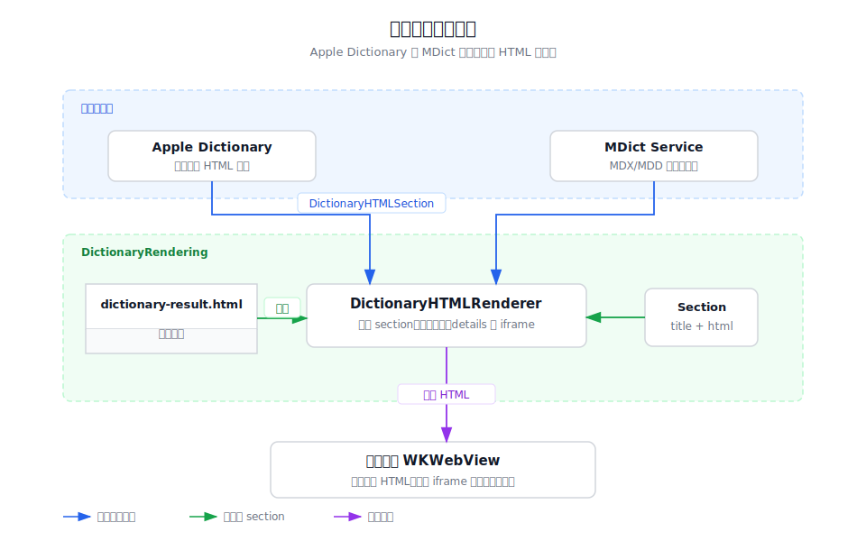

# 词典结果渲染

`DictionaryRendering` 是词典类服务共用的 HTML 结果渲染基础设施。它只负责把已经查到、
已经完成资源处理的词典条目组装成 Easydict 结果面板可加载的 HTML，不负责查词、网络请求、
资源解析或服务配置。



## 目录结构

```
DictionaryRendering/
├── DictionaryHTMLRenderer.swift        # 组装词典结果 HTML、iframe 和共享样式
├── dictionary-result.html              # WKWebView 加载的结果面板外层模板
├── dictionary-rendering-overview.md    # 本目录说明
└── dictionary-rendering-architecture.svg
```

## 职责边界

- `DictionaryHTMLRenderer` 接收 `DictionaryHTMLSection` 列表，过滤空内容后生成完整
  HTML 字符串，并把每个词典条目放进独立 iframe。
- `dictionary-result.html` 提供结果面板的外层结构、折叠分组样式、iframe 高度更新、
  深色模式颜色适配和字体缩放脚本。
- Apple Dictionary 与 MDict 服务仍分别拥有查词、资源定位、链接处理和服务级错误处理；
  本目录只提供两者共用的展示壳。

## 主要数据流

词典服务先完成查询并生成若干 `DictionaryHTMLSection`，再调用
`DictionaryHTMLRenderer.render(word:sections:)`。渲染器读取 `dictionary-result.html`
模板，把大标题、词典标题和 iframe `srcdoc` 内容插入模板，最终把完整 HTML 交给结果面板的
WKWebView 加载。

## 调试入口

- 如果结果面板为空，先检查传入的 `sections` 是否全部为空字符串。
- 如果样式或高度异常，优先检查 `dictionary-result.html` 中的 iframe 高度更新脚本。
- 如果某个词典内容缺少图片、音频或链接行为，应回到具体服务的资源解析代码排查。
