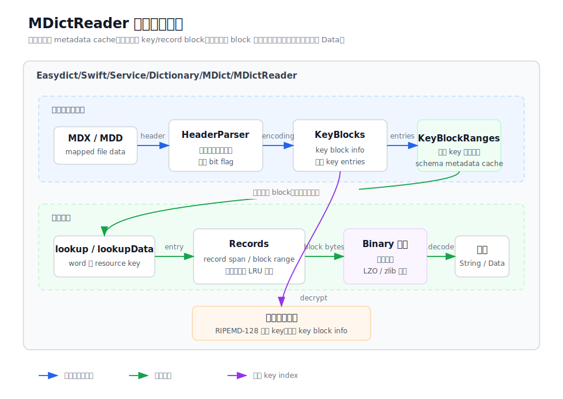

# MDictReader

`MDictReader` 目录承载 MDX/MDD 二进制格式读取层。它把文件 header、key block、record
block、压缩块和加密 key index 等细节隔离在 reader 内部，向上只暴露按 key 查询文本或二进制
资源的能力。reader 初始化优先复用磁盘 metadata cache；命中查询时只解析候选 key block，
并在 block 内用二分定位词条。



## 目录结构

```
MDictReader/
├── MDictReader.swift                  # reader 状态、初始化、lookup API 和共享模型
├── MDictMetadataCache.swift           # 持久化 header、key block range 和 record block range
├── MDictHeaderParser.swift            # header XML 和编码属性解析
├── MDictKeyBlocks.swift               # key block metadata、边界 key 和按需 entry 解析
├── MDictKeyIndex.swift                # key block 边界二分、block 内二分和 entry index 定位
├── MDictRecords.swift                 # record block metadata、范围、缓存和内容读取
├── MDictBinary.swift                  # big-endian 读取、范围校验、zlib 解压和 key info 解密
├── MDictRIPEMD128.swift               # Encrypted=2 key index 解密用 RIPEMD-128
├── mdict-reader-overview.md           # 本目录说明
└── mdict-reader-architecture.svg
```

## 职责边界

- `MDictReader` 是 MDX/MDD 文件读取入口，初始化时复用或生成 header、key block 边界和
  record block metadata，不再展开整本词典的 key entries。
- `MDictMetadataCache` 将轻量结构索引持久化到 Application Support，并用文件路径、大小、
  修改时间和 schema version 失效。
- `MDictHeaderParser` 只负责从 header XML 中提取版本、标题、编码、格式、大小写敏感和加密
  标记。
- `MDictKeyBlocks` 负责解析 key block info，并在查询命中某个 block 时按需解压和解析 key
  entries；必要时解密 Encrypted=2 的 key block info。
- `MDictRecords` 负责根据 record offset 定位 record block，按需解压并缓存 record block。
- `MDictBinary` 和 `MDictRIPEMD128` 是底层工具，不处理词典导入、资源链接重写、UI 或 HTML
  渲染。

## 主要流程

初始化时，`MDictReader` 读取文件数据并解析 header。随后 reader 只解析 key block info 中的
首尾 key、entry 数量和压缩尺寸，读取 record block metadata 生成 `RecordBlockRange`。这个阶段
不会解压全部 key block，也不会为整本词典建立全量 key index。

查询文本时，`lookup` 或 `lookupAll` 先用 key block 边界二分出候选 block，只解压这些 block，
再在 block 内对已排序 entries 做 lower/upper bound，直接取得匹配词条范围。随后 reader 根据
相邻 entry 计算 record span，定位包含该 offset 的 record block，按需解压并读取 record bytes，
最后按 header encoding 解码为字符串。查询 MDD 资源时，`lookupData` 走同一套 key 和 record
读取流程，但直接返回原始 `Data`。

## 调试入口

- header 或编码异常时，从 `MDictHeaderParser.parseHeader` 和 `readAttribute` 开始排查。
- 查词无结果时，检查 `MDictKeyIndex` 的边界定位、block 内二分、大小写敏感配置和按需 key
  entry 解析。
- record 内容错位时，检查 `MDictRecords.recordSpan`、`RecordBlockRange` 和 block 边界。
- 解压失败或文件越界时，优先看 `MDictBinary.decompressBlock`、`ensureAvailable` 和大小限制。
- Encrypted=2 文件异常时，检查 `decryptKeyBlockInfo` 与 `MDictRIPEMD128` 的 key 派生逻辑。
