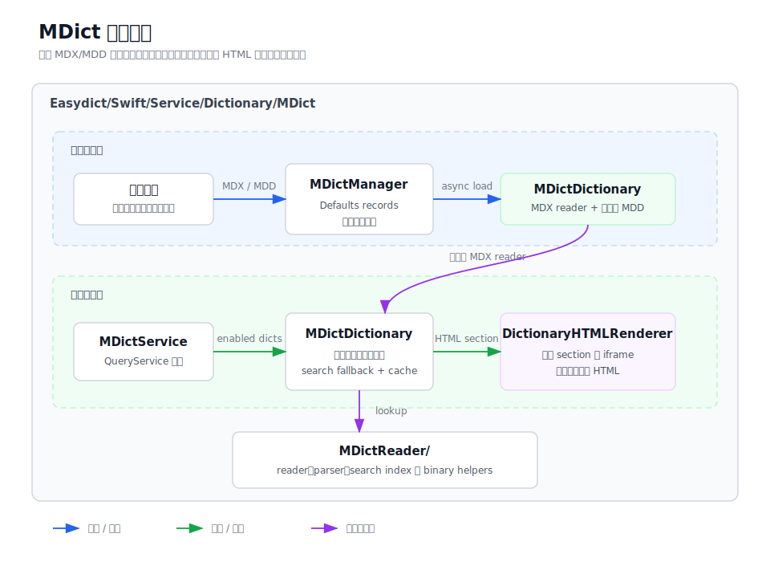

# MDict

`MDict` 实现用户导入的 MDX/MDD 离线词典查询能力。它负责管理词典文件、解析二进制索引、
查询条目内容、重写词典内资源链接，并把结果交给共享的词典 HTML 渲染层展示。



## 目录结构

```
MDict/
├── MDictService.swift                 # 查询服务入口和结果 HTML 包装
├── MDictConfigurationView.swift       # 设置页导入、启用、排序和删除 UI
├── MDictManager.swift                 # 导入记录持久化、加载和生命周期管理
├── MDictDictionary.swift              # 单本词典查询、MDD 资源解析和链接重写
├── MDictSearchIndex.swift             # 变形词、prefix、substring 和 fuzzy fallback
├── MDictReader/                       # MDX/MDD 二进制 reader、parser 和底层工具
├── mdict-overview.md                  # 本目录说明
└── mdict-architecture.svg
```

## 职责边界

- `MDictService` 是 `QueryService` 子类，负责读取启用词典、收集查询结果，并调用
  `DictionaryHTMLRenderer` 生成结果面板 HTML。
- `MDictConfigurationView` 是设置页 UI，负责触发 MDX/MDD 导入，并把启用、排序和删除操作
  转发给 `MDictManager`。
- `MDictManager` 保存导入记录到 `Defaults`，查询时按需在后台加载启用的
  `MDictDictionary` 实例，并在记录变化时发出通知。
- `MDictDictionary` 表示一本 MDX 词典和它的 MDD 资源集合，负责查词、查资源、把图片、音频、
  CSS 和脚本资源重写为 WebKit 可加载的形式；MDD reader 会在首次资源查询时懒加载，并缓存
  常用 data URI、解析后的 CSS、MDX 同目录同名 CSS 文件和资源缺失结果。
- `MDictSearchIndex` 在精确查词失败后按需建立轻量 headword 索引，提供变形词、前缀、词头
  substring 和小编辑距离 fuzzy fallback，不索引正文 HTML；超大词库会跳过这个同步 fallback，
  避免单次 miss 触发全量 key block 解析。
- `MDictReader/` 子目录只处理 MDX/MDD 二进制格式，不处理 UI、服务配置或结果面板样式。

## 主要流程

导入流程从 `MDictConfigurationView` 的文件选择器开始，`MDictManager` 根据扩展名导入 MDX
或匹配 MDD，合并同名资源文件并保存 `MDictDictionaryRecord`。MDD 匹配保留精确同名优先，
只把短数字后缀当作 multipart 资源后缀处理，避免年份等普通文件名误挂到无关 MDX。文件选择器
使用 MDX/MDD 扩展名类型并以通用 data 类型兜底，避免系统未注册自定义扩展名时没有可选类型。
首次查询启用词典时，`MDictManager` 在后台创建缺失的 `MDictDictionary`，并按 `records`
中的用户排序返回词典，保证查询优先级和显示顺序一致。

查询流程从 `MDictService.translate` 开始。服务读取启用的 `MDictDictionary`，逐本调用
`lookup`，词典内部先通过 `MDictReader` 精确查找 key entry 和 record block；如果无结果，再
尝试常见英文变形词，并按需构建 headword 搜索索引用于 prefix、substring 和 fuzzy fallback。
超大词库只走精确查词和变形词路径，避免一次查询 miss 阻塞 UI。
命中后再把 HTML 中的本地资源链接改写为 data URI 或内部锚点。只有命中结果需要解析 MDD
资源时，词典才会创建对应的 resource reader。图片、音频和 CSS url 生成的 data URI 会按 LRU
缓存；外链 stylesheet 解析后的 CSS 也会缓存，并复用已缓存的内嵌资源。资源 key 查询会先尝试
词条原始路径，再生成反斜杠和前导斜杠变体，兼容不同 MDD 生成器的路径风格。CSS 和脚本等文本
资源优先使用 MDX header encoding 解码，再回退到常见 Unicode 编码；如果 CSS 内部资源受
单次 data URI 预算影响未完全替换，这份结果不会进入 stylesheet 缓存。最终服务把每本词典
的 HTML section 交给
`DictionaryHTMLRenderer`，由共享词典结果模板渲染。
如果 MDX 文件旁边存在同名 `.css`，例如 `concise-enhanced.mdx` 对应
`concise-enhanced.css`，`MDictDictionary` 会在首次命中 HTML 查询时读取并缓存该样式，然后
注入到词条内容前面，适配 MDict 词库常见的外置样式优化文件。
资源改写会优先处理脚本、stylesheet、图片和 CSS url，再处理音频链接；内联脚本会保留结果页
CSP 所需的 nonce，`javascript:new Audio(...)` 中的本地音频会先被改写为 data URI，并由结果页
click handler 拦截播放，避免被 CSP 当作导航阻断。`mdict-entry://` 跳转由结果面板按 href
payload 查询，而不是依赖锚点展示文本。
单次查询有 data URI 数量和总字节预算，避免大词条因为数百个发音资源被同步内联而阻塞查询。

## 调试入口

- 导入失败时，先检查文件扩展名、MDX/MDD 同名匹配，以及 `MDictManager.loadErrors`。
- 查询无结果时，检查 `MDictManager.dictionariesForLookup()`、词典大小写设置、key block
  边界和 `MDictSearchIndex` fallback candidates。
- 图片、音频或样式缺失时，优先检查 `MDictDictionary` 的 resource key candidates、同名
  `.css` 文件路径、资源重写和 data URI/CSS cache 命中。
- 解析、解压或加密相关错误，从 `MDictReader/` 子目录里的 `MDictReader`、`MDictBinary`、
  `MDictKeyBlocks` 和 `MDictRecords` 开始定位。
- 结果面板样式或高度异常，回到 `MDictService.wrapWithStyle` 与 `DictionaryHTMLRenderer` 排查。
