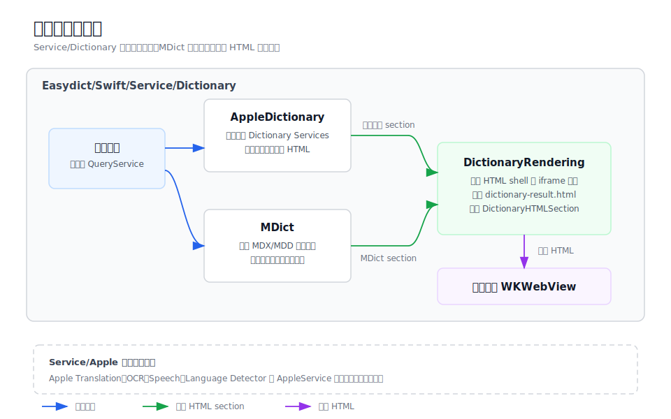

# 词典服务

`Dictionary` 聚合 Easydict 的词典类服务和它们共用的 HTML 结果渲染基础设施。它只包含以本地
或系统词典条目为核心的查询能力，不包含 Apple 翻译、OCR、语音或语言检测等平台能力。



## 目录结构

```
Dictionary/
├── AppleDictionary/                 # Apple 系统词典服务
├── MDict/                           # MDict/MDX/MDD 离线词典服务
├── DictionaryRendering/             # 共享 HTML 结果壳和 iframe 渲染
├── README.md                        # 本目录说明
└── dictionary-services-architecture.svg
```

## 职责边界

- `AppleDictionary` 调用系统 Dictionary Services 获取 macOS 内置词典条目。
- `MDict` 负责导入、解析和查询 MDX/MDD 文件，并处理词典内资源。
- `DictionaryRendering` 接收各词典服务产出的 HTML section，组装结果面板模板。
- `Service/Apple` 保留 Apple 平台能力，如翻译、OCR、语音和语言检测。

## 主要数据流

用户查询进入具体词典服务后，服务产出 `DictionaryHTMLSection`。共享渲染层把多个 section
组装到 `dictionary-result.html` 模板中，最终由结果面板的 WKWebView 加载。

## 调试入口

- 系统词典未命中，检查 `AppleDictionary` 的条目查询和过滤逻辑。
- MDict 未命中或资源缺失，检查 reader、manager 和资源路径重写。
- 结果高度或样式异常，检查 `DictionaryRendering` 的模板与 iframe 更新脚本。
