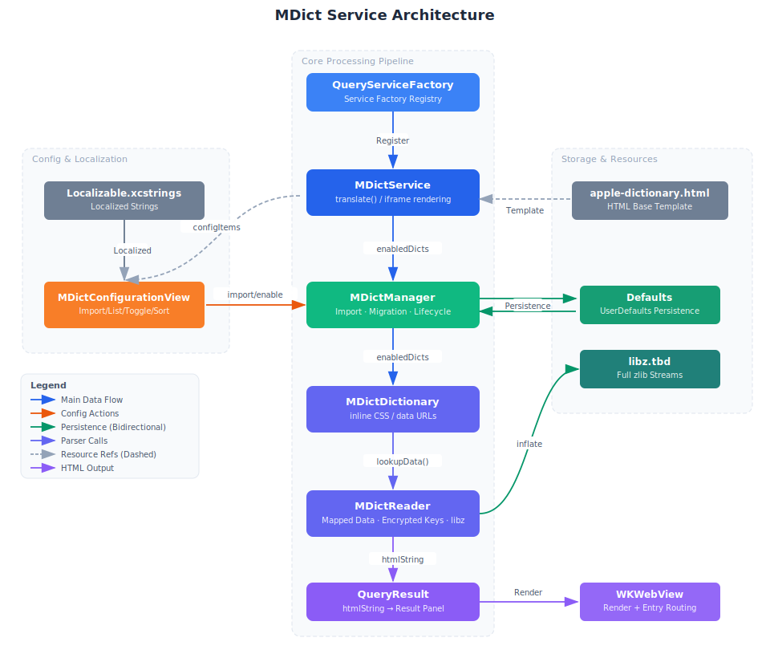

# MDict Dictionary Service

MDict (`.mdx` / `.mdd`) is a widely used offline dictionary format supporting HTML rich text and multimedia resources.
This directory implements importing, parsing, and querying of MDict files, integrated as a standard Easydict service.



## Directory Structure

```
MDict/
├── MDictReader.swift          # MDict binary format parser (Header, Key blocks, Record blocks, zlib)
├── MDictDictionary.swift      # High-level dictionary wrapper (Lookup, MDD resource resolution, links)
├── MDictManager.swift         # Dictionary lifecycle management (Import, Persistence, Toggle, Sort)
├── MDictService.swift         # QueryService subclass, HTML rendering and framework integration
└── MDictConfigurationView.swift  # SwiftUI settings panel (Import, List, Toggle, Sort)
```

## Core Components

### MDictReader

Low-level parsing of MDict v1.x / v2.x binary format:

- **Header Parsing**: Reads UTF-16LE encoded XML header to extract version, encoding, format, title, etc.
- **Key Block Parsing**: Reads key info (v2 has separate compressed key info), decompresses to build an in-memory index of `word → recordOffset` (`[String: Int]`).
- **Record Block Reading**: Decompresses target record blocks on-demand and extracts definition data from offsets.
- **Compression Support**: Supports zlib (type `0x02`) and no compression (type `0x00`). LZO will throw an error with a hint.

### MDictDictionary

Wraps an MDX file and its accompanying MDD file:

- `lookup(_:)` — Looks up a word and returns HTML/text definition. Case-insensitive; automatically tries title case if needed.
- `lookupResource(_:)` — Reads binary resources (images, audio) from MDD files (used by WKWebView interceptor).
- Replaces `entry://` and `sound://` link prefixes to prevent WKWebView navigation jumps.

### MDictManager

Singleton responsible for persistence and runtime management:

- Saves imported dictionary path lists via `Defaults` (`UserDefaults` wrapper).
- Automatically discovers MDD files with the same name in the same directory (supports multiple parts).
- Provides enable/disable, reordering, and deletion operations, broadcasting `MDictManagerDidChange` notification on change.

### MDictService

Inherits from `QueryService`, implementing standard query interfaces:

- `serviceType()` returns `.mdict`, registered in `QueryServiceFactory`.
- `translate(_:from:to:)` iterates through all enabled dictionaries, wraps HTML definitions in `<iframe>`, reusing the `apple-dictionary.html` framework template.
- Plain text dictionary entries are automatically converted to HTML paragraphs.

### MDictConfigurationView

SwiftUI `Section` injected into the settings panel via `service.configurationListItems()`:

- Displays titles and filenames of imported dictionaries, supporting toggles, drag-to-sort, and swipe-to-delete.
- `+` button in the top right triggers a file picker (only shows `.mdx` files).
- Shows an Alert with error details if import fails.

## Main Data Flow

```
User Input Query
    ↓
MDictService.translate(_:from:to:)
    ↓
MDictManager.enabledDictionaries  ← Defaults Persistence
    ↓
MDictDictionary.lookup(_:)
    ↓
MDictReader.lookupData(for:)      ← Memory Key Index O(1)
    ↓
decompressBlock / readRecord      ← On-demand Decompression
    ↓
HTML Wrap → QueryResult.htmlString
    ↓
WKWebView Rendering
```

## Debugging

- **Parsing Failure**: `MDictError` carries detailed info like format version and compression type, output via `logError`.
- **Loading Error**: `MDictManager.loadErrors` dictionary records errors for each path, viewable in the config view.
- **Lookup Miss**: Check if `MDictReader.keyIndex` contains the target word (mind the case policy).
- **Encrypted Dicts**: Throws `MDictError.encrypted` directly (not currently supported).

## Format Version Differences

| Feature | v1.x | v2.x |
|------|------|------|
| Integer Width | 4 bytes | 8 bytes |
| Key Info Compression | None | zlib |
| Checksum | None | adler32 |
| Offset Width | 4 bytes | 8 bytes |
