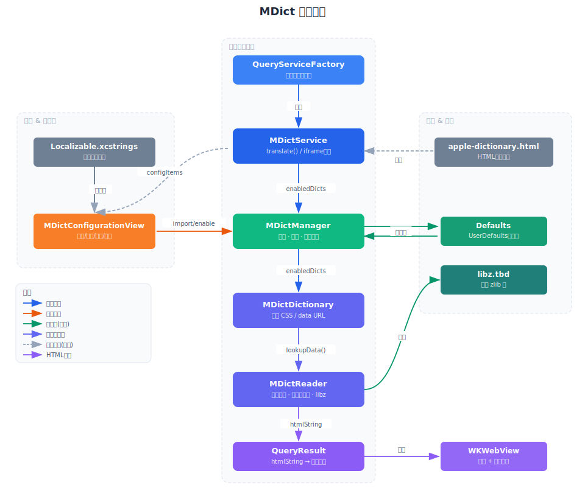

# MDict 词典服务

MDict（`.mdx` / `.mdd`）是一种广泛使用的离线词典格式，支持 HTML 富文本释义和多媒体资源。
本目录实现了对 MDict 文件的导入、解析与查询，并以 Easydict 标准服务的形式接入翻译结果面板。



## 目录结构

```
MDict/
├── MDictReader.swift          # MDict 二进制格式解析器（头部、键块、记录块、libz 解压）
├── MDictDictionary.swift      # 高层词典封装（查词、MDD 资源解析、链接转义）
├── MDictManager.swift         # 词典生命周期管理（导入、持久化、启用/禁用、排序、删除）
├── MDictService.swift         # QueryService 子类，HTML 渲染并接入主框架
└── MDictConfigurationView.swift  # SwiftUI 设置面板（导入、列表、开关、排序、删除）
```

## 核心组件

### MDictReader

实现 MDict v1.x / v2.x 二进制格式的低层解析：

- **头部解析**：读取 UTF-16LE 编码的 XML 头部，提取版本、编码、格式、标题等属性。
  对 `Encoding` 为空的 MDD 资源库（`Library_Data`）按 UTF-16LE 解析，兼容常见资源包。
- **键块解析**：读取键块信息区（v2 有独立的压缩键块信息），支持解密
  `Encrypted="2"` 的 key index，解压后构建
  `word → recordOffset` 的内存索引（`[String: Int]`）。
- **记录块读取**：尽可能以内存映射方式读取词典文件，按需解压目标记录块，
  再从偏移量提取单条释义数据。
- **压缩支持**：通过系统 `libz` 支持 zlib（类型 `0x02`），同时支持无压缩
  （类型 `0x00`）；LZO 会抛出有提示的错误。

### MDictDictionary

封装一个 MDX 文件及其配套 MDD 文件：

- `lookup(_:)` — 对查词文本先去除首尾空白，再按原始顺序返回所有匹配的 HTML/文本释义，
  让同一词头的多条记录堆叠展示；对大小写不敏感词典自动尝试小写和首字母大写形式。
- `lookupResource(_:)` — 从 MDD 文件中读取 CSS、图片、音频等二进制资源，会同时尝试
  原始路径、前导反斜杠、斜杠转反斜杠和去前导反斜杠形式，并在查找时忽略查询串和片段。
- 将 `entry://` 链接改写为应用内查词链接，内联样式表链接，并把 MDD 图片/音频
  资源（包括 `srcset` 候选项）转换成 `data:` URL，让 WKWebView 不依赖自定义 scheme
  handler 也能渲染。

### MDictManager

单例，负责持久化与运行时管理：

- 通过 `Defaults`（`UserDefaults` 封装）保存已导入词典的路径列表。
- 导入时自动发现同目录下同名 MDD 文件（支持多个 MDD 分卷）。
- 同时接受 `.mdx` 词典文件和 `.mdd` 资源文件导入。MDD 会合并到同名 MDX 记录，
  历史设置里的独立 MDD 记录会迁移成资源路径。
- 提供启用/禁用、重排序、删除等操作，变更后发送 `MDictManagerDidChange` 通知。

### MDictService

继承 `QueryService`，实现 standard 查询接口：

- `serviceType()` 返回 `.mdict`，注册于 `QueryServiceFactory`。
- `translate(_:from:to:)` 遍历所有已启用词典，将 HTML 释义包裹在 `<iframe>` 中，
  复用 `apple-dictionary.html` 框架模板进行渲染。
- 纯文本词典条目自动转换为 HTML 段落。
- 内嵌媒体与图标资源会在渲染前做尺寸归一化，确保发音按钮在结果面板内保持紧凑。
- 音频链接会在当前位置播放，页内锚点会在当前条目内滚动，不再离开或重新加载 iframe。
- MDict 结果 HTML 由结果面板的 WKWebView 直接加载，`mdict-entry://` 导航会回到
  Easydict 查词流程。

### MDictConfigurationView

SwiftUI `Section`，通过 `service.configurationListItems()` 注入设置面板：

- 列表显示已导入词典的标题与文件名，支持开关、拖拽排序、显式垃圾桶按钮删除和滑动删除。
- 右上角 `+` 按钮触发文件选择器，可选择 `.mdx` 和 `.mdd` 文件。
- 导入失败时弹出 Alert 展示错误信息。

## 主要数据流

```
用户输入查词
    ↓
MDictService.translate(_:from:to:)
    ↓
MDictManager.enabledDictionaries  ← Defaults 持久化
    ↓
MDictDictionary.lookup(_:)
    ↓
MDictReader.lookupData(for:)      ← 内存键索引 O(1)
    ↓
decompressBlock / readRecord      ← 按需解压记录块
    ↓
HTML 包裹 → QueryResult.htmlString
    ↓
WKWebView 渲染 + mdict-entry 查词路由
```

## 调试入口

- **解析失败**：`MDictError` 携带格式版本、压缩类型等详细信息，通过 `logError` 输出。
- **加载错误**：`MDictManager.loadErrors` 字典记录每个词典路径对应的错误，可在配置视图中展示。
- **查词未命中**：检查 `MDictReader.keyIndex` 是否包含目标词（注意大小写策略）。
- **加密词典**：支持 `Encrypted="2"` 的 key index 加密；`Encrypted="1"` 仍会抛出
  `MDictError.encrypted`，因为它需要注册信息。

## 格式版本差异

| 特性 | v1.x | v2.x |
|------|------|------|
| 整数宽度 | 4 字节 | 8 字节 |
| 键块信息压缩 | 无 | zlib |
| 校验和 | 无 | adler32 |
| 偏移量宽度 | 4 字节 | 8 字节 |
| 键块信息加密 | 不使用 | 支持 `Encrypted="2"` |
