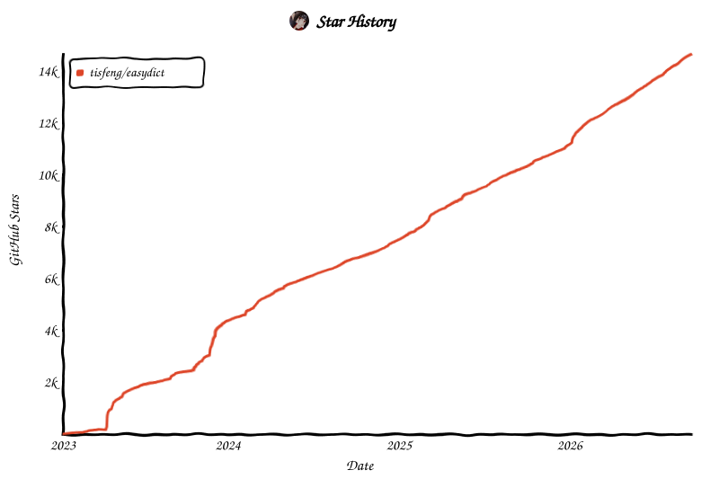

<p align="center">
  
  <h1 align="center">Easydict</h1>
  <h4 align="center"> Easy to look up words or translate text</h4>
<p align="center"> 
<a href="https://github.com/tisfeng/easydict/blob/main/LICENSE">
</a>
<a href="https://github.com/tisfeng/Easydict/releases">
</a>
<a href="https://img.shields.io/badge/-macOS-black?&logo=apple&logoColor=white">
</a>  
</p>

<div align="center">
<a href="./README_ZH.md">中文</a> &nbsp;&nbsp;|&nbsp;&nbsp; <a href="./README.md">English</a>
</div>

## Easydict

`Easydict` is a concise and easy-to-use translation dictionary macOS App that allows you to easily and elegantly look up words or translate text.

Easydict is ready to use out of the box, can automatically recognize the language of the input text, supports input translate, select translate, and OCR screenshot translate, and can query multiple translation services results at the same time.

**Supported translation services:** [**🍎 Apple Dictionary**](./docs/user-docs/en/How-to-use-macOS-system-dictionary-in-Easydict.md), [🍎 **Apple Translate**](./docs/user-docs/en/How-to-use-macOS-system-translation-in-Easydict.md), [OpenAI](https://chat.openai.com/), [Gemini](https://gemini.google.com/), [DeepSeek](https://www.deepseek.com/), [Ollama](https://ollama.com/), [Groq](https://groq.com/), [Zhipu AI](https://open.bigmodel.cn/), [GitHub Models](https://github.com/marketplace/models), [DeepL](https://www.deepl.com/translator), [Google](https://translate.google.com), [Youdao](https://www.youdao.com/), [Tencent](https://fanyi.qq.com/), [Bing](https://www.bing.com/translator), [Baidu](https://fanyi.baidu.com/), [Niutrans](https://niutrans.com/), [Caiyun](https://fanyi.caiyunapp.com/), [Alibaba](https://translate.alibaba.com/), [Volcano](https://translate.volcengine.com/translate) and [Doubao](https://www.volcengine.com/docs/82379/1820188).


<table>
    <td> 
    <td> 
</table>


## Features

- 🚀 Out of the box, automatic language recognition
- 🖱️ Auto select with mouse and shortcut key
- 📸 OCR screenshot translation and slient screenshot OCR
- 🔊 Multiple TTS voice services
- 📚 Support 🍎 [Apple System Dictionary](./docs/user-docs/en/How-to-use-macOS-system-dictionary-in-Easydict.md) and [System Translation](./docs/user-docs/en/How-to-use-macOS-system-translation-in-Easydict.md)
- 🌐 Support 20+ translation services (OpenAI, Gemini, DeepL, Google, Ollama, Groq, etc.)
- 🗣️ Support for 48 languages

**If you like this app, please consider giving it a [Star](https://github.com/tisfeng/Easydict) ⭐️, thanks! (^-^)**

## Contributing

Contributions through issues and pull requests are welcome. Read the Chinese
[contribution guide](./CONTRIBUTING.md) for the development workflow and pull
request requirements.

### AI Coding

We welcome contributions assisted by programming agents such as `Codex` and
`Claude`. Prefer the latest available GPT or Claude model suitable for complex
coding tasks, and carefully review and test the final changes. See the Chinese
[contribution guide](./CONTRIBUTING.md) for the Agent workflow and
review requirements.

## Issue/PR Triage Notes

The maintainer has been quite busy recently and usually only has time to triage issues on weekends. PRs (especially bugfix PRs) are prioritized. Also, due to an overloaded inbox and notifications, some messages may not be seen or replied to promptly. Thanks for your understanding.

## Installation

### Homebrew Installation (Recommended)

```bash
brew install --cask easydict
```

### Manual Installation

[Download](https://github.com/tisfeng/Easydict/releases) the latest release.

> [!NOTE]
> Latest version supports macOS 13.0+, for older systems please use [2.7.2](https://github.com/tisfeng/Easydict/releases/tag/2.7.2)

---

## Usage

| Ways                      | Description                                                                                                                                  | Preview                                                                                                                                        |
| ------------------------- | -------------------------------------------------------------------------------------------------------------------------------------------- | ---------------------------------------------------------------------------------------------------------------------------------------------- |
| Input Translate           | Press the input translate shortcut key (default `⌥ + A`), enter the text to be translated, and `Enter` key to translate          |  |
| Mouse Select Translate    | The query icon is automatically displayed after the word is selected, and the mouse hovers over it to query                                  |  |
| Shortcut Select Translate | After selecting the text to be translated, press the shortcut key (default `⌥ + D`)                                                          |  |
| Screenshot Translate      | Press the screenshot translate shortcut key (default `⌥ + S`) to capture the area to be translated                                           |  |
| Silent Screenshot OCR     | Press the Silent Screenshot shortcut key（default `⌥ + ⇧ + S`）to capture the area, the OCR results will be copied directly to the clipboard |                      |

---

## Documentation

- 📚 [Public Documentation Index](./docs/user-docs/README.md) - English and Chinese guides
- 📖 [Complete Usage Guide](./docs/user-docs/en/GUIDE.md) - Detailed features, configuration and tips
- 🔧 [Developer Build Guide](./docs/user-docs/en/GUIDE.md#developer-build) - Build and run from source code
- 🍎 [How to use macOS System Dictionary](./docs/user-docs/en/How-to-use-macOS-system-dictionary-in-Easydict.md)
- 🍎 [How to use macOS System Translation](./docs/user-docs/en/How-to-use-macOS-system-translation-in-Easydict.md)
- 🌍 [How to translate Easydict](./docs/user-docs/en/How-to-translate-Easydict.md)

---

## Acknowledgements

- This project was inspired by [saladict](https://github.com/crimx/ext-saladict) and [Bob](https://github.com/ripperhe/Bob), and the initial version was made based on [Bob (GPL-3.0)](https://github.com/1xiaocainiao/Bob). Easydict has made many improvements and optimizations on the original project, and many features and UI are referenced from Bob.
- Screenshot feature is based on [isee15](https://github.com/isee15)'s [Capture-Screen-For-Multi-Screens-On-Mac](https://github.com/isee15/Capture-Screen-For-Multi-Screens-On-Mac), and optimized on this project.
- Select text feature is referenced from [PopClip](https://pilotmoon.com/popclip/).

## Statement

Easydict is licensed under the [GPL-3.0](https://github.com/tisfeng/Easydict/blob/main/LICENSE) open source license, which is for learning and communication only. Anyone can get this product and source code for free. If you believe that your legal rights have been violated, please contact the [author](https://github.com/tisfeng) immediately. You can use the source code freely, but you must attach the corresponding license and copyright.

## Sponsor

Easydict is a free and open source project, currently mainly developed and maintained by the author. If you like this project and find it helpful, you can consider sponsoring this project to support it, so that it can go further.

Thanks to [@CanglongCl](https://github.com/CanglongCl) for providing the Apple Developer account, which solved the app [signature issue](https://github.com/tisfeng/Easydict/issues/2), allowing more people to use Easydict conveniently.

<a href="https://afdian.com/a/tisfeng"></a>

<div>
  
</div>

Thanks to all sponsors for their generous support. For details, please see the [Sponsor List](./docs/user-docs/en/SPONSOR_LIST.md).

---

## Star History

<a href="https://tisfeng.github.io/Easydict/star-history/#tisfeng/easydict&Date">
  <picture>
    <source media="(prefers-color-scheme: dark)" srcset="./docs/assets/star-history/star-history-dark.svg" />
    <source media="(prefers-color-scheme: light)" srcset="./docs/assets/star-history/star-history-light.svg" />
    
  </picture>
</a>
