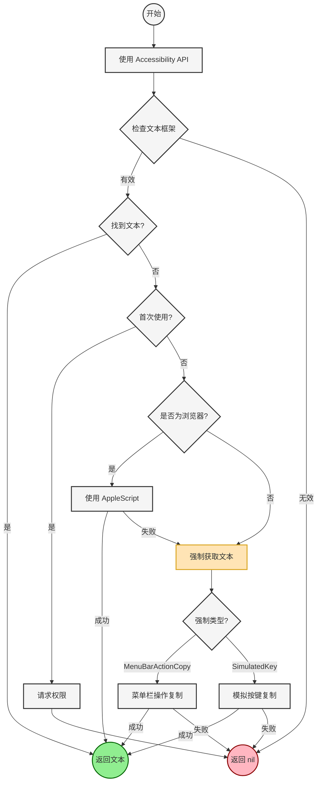

# 文本选择流程

```mermaid
flowchart TD
    Start((开始)) --> CheckAX[使用 Accessibility API]

    CheckAX --> CheckFrame{检查文本框架}
    CheckFrame -- 有效 --> TextFound{找到文本?}
    CheckFrame -- 无效 --> EndFail((返回 nil))

    TextFound -- 是 --> EndSuccess((返回文本))
    TextFound -- 否 --> FirstTime{首次使用?}

    FirstTime -- 是 --> RequestPerm[请求权限]
    FirstTime -- 否 --> CheckBrowser{是否为浏览器?}

    RequestPerm --> EndFail

    CheckBrowser -- 是 --> UseAS[使用 AppleScript]
    CheckBrowser -- 否 --> ForceGet[强制获取文本]

    UseAS -- 成功 --> EndSuccess
    UseAS -- 失败 --> ForceGet

    ForceGet --> CheckForceType{强制类型?}
    CheckForceType -- MenuBarActionCopy --> MenuCopy[菜单栏操作复制]
    CheckForceType -- SimulatedKey --> SimKey[模拟按键复制]

    MenuCopy -- 成功 --> EndSuccess
    MenuCopy -- 失败 --> EndFail

    SimKey -- 成功 --> EndSuccess
    SimKey -- 失败 --> EndFail

    classDef default fill:#f5f5f5,stroke:#333,stroke-width:2;
    classDef success fill:#90EE90,stroke:#006400;
    classDef failure fill:#FFB6C1,stroke:#8B0000;
    classDef force fill:#FFE4B5,stroke:#DAA520;

    class EndSuccess success;
    class EndFail failure;
    class ForceGet force;
```
