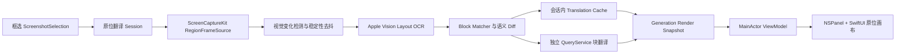

# 原位截图翻译与自动重译

**Status:** completed
**Created:** 2026-08-30
**Updated:** 2026-08-31
**Owner:** Eric Pan
**Links:** 当前用户请求

**Archive note:** 本地实现、自动化验证、Release 构建和独立复审已完成；发布前桌面 QA
门禁见“实施验证结果”和“完整验收清单”。

## 任务契约

- 任务模式：`implementation`
- 用户目标：为 Easydict 增加完整的“原位截图翻译”能力；用户框选屏幕区域后，常驻浮窗
  按原文位置覆写译文，并可切换语言、原文/译文、翻译服务、置顶和自动更新；区域内容变化
  后自动重新 OCR 和重翻译。产品功能、界面、架构、软件工程流程和测试必须在同一计划中
  闭环，不拆分为一阶段、二阶段。
- 允许动作：修改计划内的产品代码、测试、Xcode 工程、String Catalog 与设置；
  运行格式、静态检查、focused 测试、Debug/Release 构建和不触发外部服务的验证；完成后记录
  history、归档 ExecPlan，并按仓库规则执行一次 scoped 自动本地提交。
- 允许修改路径：本计划“影响路径”列出的 `Easydict/`、`EasydictTests/`、
  `Easydict.xcodeproj/project.pbxproj`、`docs/exec-plans/` 和 `docs/histories/` 相关路径。
- 预期交付物：可使用的原位截图翻译与自动重译功能、完整界面与设置、六 locale 文案、行为
  测试、构建与验证证据、完成历史和已归档 ExecPlan。
- 验收标准：本计划的实现项与可自动化门禁满足，且现有截图翻译/OCR 行为不回归；任何无法
  在当前桌面环境验证的真实 TCC、多系统或外部 provider 项必须明确记录为发布前手工门禁，
  不能伪装为已验证。

## 自动提交状态

- 自动提交资格：`eligible`；本任务已由用户提升为 implementation，验证通过后按仓库规则
  执行一次 scoped 自动本地提交。
- 初始暂存区：`empty`
- 初始工作树：`clean`
- 初始未跟踪路径：仅本 Agent 上一规划任务创建的
  `docs/exec-plans/active/2026-08-30-in-place-screenshot-translation.md`，无用户路径重叠。
- 初始分支：`dev`，HEAD `186adb8c95fda40554dfe1aa0389d70cd9d565c5`，相对
  `origin/dev` ahead 2 / behind 3。
- 自动提交结果：本实现、测试、history 与已归档计划由本文件所在的一次 scoped local commit
  记录；未 push。

## 输入来源

- 用户明确请求：框选区域后显示不因失焦消失的翻译浮窗；译文按原文位置覆写；底部可切换
  翻译语言、原文/译文等；计划需包含完整功能、界面与工程过程，并将自动重译纳入同一次交付。
- 仓库规则：`AGENTS.md`、`docs/agents/`、`docs/architecture/overview.md`、
  `docs/exec-plans/README.md`。
- 附件或引用材料：用户对同类翻译软件交互的文字说明；此前提供的权限截图仅作为当前截图
  权限背景，不作为界面指令。
- 仅作为证据的内容：当前截图框选、Apple Vision OCR、查询服务、窗口、快捷键、设置、
  String Catalog 和测试源码；本计划不依据尚未合入的外部分支行为。
- 独立复核：仓库要求的 project-level 只读规划审查已完成；复核未修改工作树，关键结论已
  纳入本计划。

## 产品定义

### 名称与定位

- 中文名称：**原位截图翻译**。
- 英文名称：**In-place Screenshot Translation**。
- 定位：现有“截图翻译”的并列模式，而不是替代模式。现有截图翻译继续把整张截图送入通用
  查询窗口；新模式提供固定屏幕区域、布局保留、常驻预览和自动重译。
- “原位”指译文在 Easydict 浮窗内按截图中的相对位置显示，不修改目标应用，也不覆盖屏幕
  原始像素。
- “自动重译”指固定区域内容稳定变化后，自动重新采集、OCR、识别变化块并翻译；它不是
  30/60 fps 的视频字幕渲染。

### 一次完整交付原则

下列能力构成一个不可拆分的验收范围：框选、常驻浮窗、原文/译文切换、原位覆写、语言和
服务控制、自动重识别/重翻译、暂停/恢复、错误恢复、隐私保护、全 locale 文案、自动化测试、
Release 构建与手工矩阵。里程碑只表示代码依赖和审查顺序，任何里程碑单独完成都不等于功能
已交付。

### 目标用户与典型场景

- 阅读网页、PDF、聊天、图片或不便复制文本的应用时，希望保留原排版快速查看译文。
- 观看字幕、演示文稿或会变化的页面时，希望同一框选区域自动更新，不反复截图。
- 对比翻译时，希望在原文和译文间即时切换，而不关闭窗口或重新查询。
- 需要控制费用和隐私时，希望明确看到当前翻译服务，并暂停自动请求。

### 产品成功标准

- 框选成功后立即出现截图浮窗，不等待 OCR 或网络翻译完成才显示。
- 浮窗失去焦点后仍保持可见；默认置顶，但可取消置顶。
- 译文块与原文块的相对位置一致，窗口缩放时不重新 OCR、不发生系统性偏移。
- 自动更新默认开启；静态区域持续 60 秒只发生初始一次 OCR/翻译，同一语义指纹不会重复
  请求翻译服务。
- 区域内容稳定变化后，至迟在 1.5 秒内选择最新帧开始处理；旧任务不能覆盖新结果。
- 只翻译新增或文本发生变化的块；未变化块复用会话内缓存。
- 浮窗和 Easydict 其他窗口不进入采集画面，不出现递归“镜厅”效果。
- 现有 `snipTranslate`、`silentScreenshotOCR`、`screenshotOCR` 行为保持不变。
- 截图像素只在本机内存中处理；只将 OCR 后的文字发送给用户明确选择的翻译服务。
- 图片、OCR 原文、译文和坐标不写入日志、历史、收藏、UserDefaults 或磁盘缓存。

## 完整范围

### 包含范围

- 菜单栏入口和可配置的全局快捷键；默认不分配快捷键，避免与既有截图动作冲突。
- 单屏固定区域框选、取消后恢复旧会话、重新框选和单实例会话管理。
- 独立、可缩放、失焦不消失的 `NSPanel` 浮窗及其完整状态 UI。
- Apple Vision 本地 OCR、稳定的布局值模型、共享坐标映射和块级翻译。
- ScreenCaptureKit 固定区域采集、排除 Easydict、自适应变化检测、去抖、语义 diff、缓存、
  取消和最新 generation 发布。
- 原文/译文切换、按住 Space 临时看原文、源/目标语言、交换语言、服务选择、自动更新、
  手动刷新、复制、置顶、重新框选和关闭。
- 设置页默认项、快捷键页、六个 locale 的 String Catalog。
- 权限、显示器、休眠、锁屏、网络、鉴权、不支持语言、限流、空 OCR、部分块失败等恢复语义。
- 单元、集成、回归、Release 隐私 canary、性能 soak 和桌面手工矩阵。
- 实现过程中的 active ExecPlan 维护、完成历史与计划归档。

### 不包含范围

- 修改目标应用、网页 DOM 或屏幕原始像素；所有显示只发生在 Easydict 浮窗。
- 跟随某个应用窗口移动；采集对象是某个显示器上的固定矩形。
- 同时运行多个原位翻译会话。
- 上传截图或启用 Youdao/其他远程 OCR fallback。
- DRM 或系统保护内容的绕过与强制捕获。
- 精确识别原字体、复杂透视重建、竖排文字和艺术字的像素级复刻。
- 30/60 fps 实时视频字幕、自动保存翻译图片或自动写入剪贴板。
- 把 live OCR/translation 写入历史、收藏或配置备份。
- 发布、push 或创建 PR；交付动作需用户后续明确授权。

## 当前行为与架构缺口

| 当前证据 | 可复用能力 | 必须补齐的缺口 |
| --- | --- | --- |
| `Easydict/Swift/Feature/Screenshot/Screenshot/Screenshot.swift` | 已统一权限检查，并按屏幕创建框选层 | completion 只返回 `NSImage`，持续采集需要 display ID、选区、scale 等不可变结果 |
| `Easydict/objc/ViewController/Window/WindowManager/EZWindowManager.m` | 已有截图翻译、截图 OCR 和恢复前台应用入口 | `snipTranslate` 进入通用结果窗，不能承载布局块、常驻区域和 live session |
| `EZRecognizedTextObservation.swift`、`OCRTextProcessor.swift` | 已保留 Vision 四点坐标、bounding box、confidence、band/section | 产品 API 没有不可变布局结果，处理器存在实例可变状态，短文本路径也不能保证布局块 |
| `OCRImageView.swift` | 已实现 Vision bottom-left 到 SwiftUI top-left 的 aspect-fit 换算 | 换算被封装在 debug view 私有方法中，无法独立单测和共享 |
| `OCRWindow.swift`、`OCRDebugView.swift` | 提供窗口和 bounding box 调试经验 | debug 三栏界面且未置顶时失焦隐藏，不能改造成产品窗口 |
| `QueryService.translate(_:from:to:)`、`QueryResult.translatedText` | 提供非流式最终翻译结果 | `QueryService` 持有可变 query/result，块并发时必须使用独立服务实例 |
| `QueryServiceFactory.swift`、`LocalStorage.swift` | 支持动态 UUID 服务和窗口级配置 | 需要单独的原位翻译服务 resolver、资格过滤与稳定的删除/暂时失败语义 |
| `ShortcutAction.swift`、`MenuItemView.swift` | 可接入菜单和全局快捷键设置 | 需要新 action、Defaults key、菜单文案和冲突校验 |

额外隐私缺口：`AppleOCREngine.recognizeText` 当前无条件将图片写入
`OCRConstants.snipImageFileURL`，部分 OCR processor/merger/measurer 日志会记录识别文本。
自动重译不能复用这些副作用；实施时必须提供纯内存 OCR 路径并移除产品路径的明文日志。

## 功能与交互规格

### 入口和会话规则

- 菜单栏增加“原位截图翻译”，与“截图翻译”“截图 OCR”并列。
- `ShortcutAction` 增加全局动作，出现在快捷键设置中；默认值为 nil。
- 同一时间只允许一个原位翻译 session。
- 若已有会话，再次触发入口时先暂停其 live stream，但保留窗口和最后快照：
  - Esc 或右键取消框选：恢复旧会话和原 live 状态。
  - 选区过小或截图失败：提示原因并恢复旧会话。
  - 新框选成功：创建新会话后再销毁旧会话，避免取消操作导致内容丢失。
- 选区限定在一块 `NSScreen`；跨屏拖动不创建跨 display session。
- 浮窗移动只移动预览，不改变原始采集区域；“重新框选”是改变区域的唯一入口。
- 切换 Space 后继续翻译该显示器同一坐标的新内容。
- 显示器断开时停止采集并提示重新框选，不猜测迁移到其他显示器。

### 完整用户流程

1. 用户从菜单或快捷键触发原位截图翻译。
2. 复用现有框选 UI 完成固定区域选择，生成带图像和几何信息的
   `ScreenshotSelection`。
3. 浮窗立即显示初始截图以及“正在识别”状态。
4. Apple Vision 本地 OCR 生成有阅读顺序和 normalized rect 的布局块。
5. 源语言为 Auto 时显示“自动（已识别语言）”；目标语言解析为明确语言。
6. 使用用户选择的单一服务按 section 翻译；当前 generation 的成功块可逐块出现。
7. 启动排除 Easydict 进程的 ScreenCaptureKit stream。
8. 内容变化通过视觉 diff、稳定性去抖和 OCR 语义 diff 后，只重译变化块。
9. 用户暂停、重新框选、改变语言/服务，或关闭窗口时，按对应规则取消并清理任务。

### 默认值

- 自动更新：开启。
- 置顶：开启；取消置顶后窗口仍不消失，只可能被其他窗口覆盖。
- 初始显示：译文。
- 源语言：复制当前全局源语言，通常为 Auto；会话内修改不写回全局语言 Defaults。
- 目标语言：使用现有语言管理器按源语言和用户首选语言解析，UI 中不允许 Auto；会话内修改
  不写回全局语言 Defaults。
- 翻译服务：优先恢复上次保存的原位翻译服务；没有有效值时，选择 Fixed Window 中第一个
  已启用且支持 `.translation` 或 `.sentence` 的服务。
- 服务被删除时可回退到新的有效默认值；鉴权失败、网络失败、限流或暂时不可用时不得静默
  切换 provider。
- live sampling：2 fps；OCR 最短间隔 1 秒；同一时刻最多 1 个 OCR 和 3 个块翻译任务。
- 单次 session 安全上限：120 个布局块、20,000 个 OCR 字符；超限时提示缩小区域，不静默
  产生大量远程请求。

### 底部工具栏

| 控件 | 行为 |
| --- | --- |
| 自动更新 | 开启时运行 live capture；关闭时真正停止 `SCStream` 并冻结当前快照，不只是忽略回调 |
| 状态 | 显示采集、识别、翻译进度、暂停和可恢复错误，不能只用颜色表达 |
| 源语言 | Auto 和 Apple OCR 支持语言；明确语言会重新 OCR，并作为 provider 源语言 |
| 交换语言 | 明确源语言直接交换；源语言为 Auto 时，用最近检测语言作为新目标，旧目标成为明确源语言 |
| 目标语言 | 仅展示当前 provider 可用的明确目标语言；改变后复用 OCR、重做翻译 |
| 原文/译文 | 原文显示最新完整截图且不画遮罩；译文显示遮罩和布局译文；切换不触发 OCR/翻译 |
| 刷新 | 绕过视觉 diff 和去抖，立即使用最新帧创建新 generation |
| 服务 | 切换后取消旧 provider 任务，清空不兼容 cache，对当前 OCR blocks 重译，不重复 OCR |
| 复制 | 有选中块时复制该块译文；无选中块时按阅读顺序复制全部译文；只有此动作写剪贴板 |
| 置顶 | 在 `.floating` 和 `.normal` 间切换，并保存为下次默认 |
| 重新框选 | 暂停当前会话；取消时恢复，成功时原子替换旧会话 |
| 关闭 | 标记 session stopped、使 generation 失效、停止 stream、取消任务并清空内存 cache |

语言、显示模式和自动更新在常规宽度下常显；服务、复制、重新框选等低频操作在窄窗口折叠
进 overflow menu。

### 键盘与块交互

- 按住 Space 临时显示原文，松开恢复此前显示模式。
- `T` 切换原文/译文，`L` 暂停/恢复自动更新，`⌘R` 手动刷新。
- `⌘C` 按“选中块优先、否则全部”的规则复制。
- Esc 优先关闭当前 popover/menu；没有临时层时关闭浮窗。
- hover 块时显示轻量边界；点击选择块；双击或 context menu 可复制该块。
- 发生文本溢出时，点击块打开可键盘访问的“原文/译文”完整内容 popover。

### 暂停、最小化与系统事件

- 手动暂停：停止 stream，取消 debounce、OCR 和翻译任务，保留最后一致快照。
- 恢复：重建 stream，并强制刷新一次。
- 面板 miniaturize、屏幕睡眠或锁屏：停止 stream；恢复后仅在原 display 仍存在时按此前
  live 状态重建并强制刷新。
- 关闭窗口：不保留截图、OCR、译文和会话 cache。
- 屏幕录制权限被撤销：停止重试，显示“打开系统设置”和“关闭”操作。

## 界面设计

### 信息架构与线框

```text
┌────────────────────────────────────────────────────────┐
│                    截图预览画布                        │
│                                                        │
│      原图 / 背景遮罩 + 原位置译文 blocks               │
│                                          更新中 2/5    │
├────────────────────────────────────────────────────────┤
│ ● 自动更新   自动(中文)  ⇄  English   [原文 | 译文]  ↻ │
│ 当前服务                                  复制  置顶  ⋯ │
└────────────────────────────────────────────────────────┘
```

- 内容区只负责截图和 block overlay；工具栏独立在底部，不计入截图 aspect ratio。
- primary row 保留 live 状态、语言、显示模式和刷新；secondary row 或 overflow 承载服务和
  管理动作。
- 状态进度靠右上角小型 pill 或工具栏状态呈现，不使用遮挡全图的 spinner。

### 窗口设计

- 使用独立 `NSPanel`，不复用 `OCRWindow`。建议 style mask 为 `.titled`、`.closable`、
  `.resizable`、`.fullSizeContentView` 和 `.nonactivatingPanel`；语言菜单和 popover 需要时允许
  panel 成为 key window。
- `hidesOnDeactivate = false`、`isReleasedWhenClosed = false`，默认 level 为 `.floating`。
- 标题栏透明，保留标准关闭、拖动、全键盘访问和窗口管理语义。
- 初始截图 viewport 尽量与选区同尺寸、同显示器位置对齐；若超出 `visibleFrame`，等比缩放
  到可见区域约 70%，不得裁剪内容。
- 工具栏高度 44–48 pt；最小窗口 360×220 pt。
- resize 只重新映射 normalized rect 和排版，不重新 OCR。
- panel 设置 `sharingType = .none` 作为防御性保护；阻止自采集的主要机制仍是
  ScreenCaptureKit content filter 排除 Easydict 整个进程。

### 原位译文渲染

- 基本翻译单元是 OCR `section`，而不是逐字、逐行或整图 merged text；这在位置、上下文、
  provider 兼容性和请求数量间取得平衡。
- block rect 是其 observations 的 union，并在渲染像素空间向外扩 2–4 px，减少原文字缘残留；
  不能跨栏合并。
- normalized rect 和可选 quadrilateral 作为布局真源；窗口大小、Retina scale 或 letterbox
  变化只经过共享几何 helper 映射。
- 遮罩策略：
  - 低方差背景使用区域中位采样色，约 92% 不透明。
  - 高方差背景使用模糊后的原区域 crop，再叠加 80–90% 的明/暗 tint。
  - 遮罩不得改变 block 外的图片。
- 文本前景按背景 luminance 选择黑或白，目标对比度至少 4.5:1。
- 从原 block 高度估算字号，再用 TextKit/CoreText 二分查找能完整容纳译文的最大字号，默认
  下限 9 pt。
- 仍放不下时显示省略号并提供完整内容 popover；不得让文字溢出到相邻 block。
- 保留 Vision 四点坐标处理一般轻微旋转；不承诺复杂透视和竖排文字像素级还原。

### 响应式规则

- 宽度足够时显示两行工具栏；中等宽度合并为单行并缩短服务名称；窄窗口只保留 live、语言、
  原文/译文和 overflow。
- screenshot viewport 始终 aspect-fit；letterbox 区域不响应 block 点击。
- toolbar 不随截图缩放；block hit target 在视觉框基础上至少扩展到 28×28 pt。
- 全屏、Space、浅色/深色外观和不同显示器 scale 不改变 normalized layout。

### 状态与反馈

| 状态 | 画布 | 工具栏反馈 | 可执行恢复 |
| --- | --- | --- | --- |
| 准备采集 | 初始截图 | “准备采集” | 关闭、重新框选 |
| 正在识别 | 保留截图 | “正在识别” | 暂停、关闭 |
| 正在翻译 | 当前 generation 的成功块逐步出现 | “正在翻译 n/m” | 暂停、切原文 |
| 已就绪 | 一致的图像与 blocks | live 状态点 | 全部控制 |
| 已暂停 | 最后一致快照 | 图标 + “已暂停” | 恢复、刷新、关闭 |
| 未识别到文字 | 最新截图、无遮罩 | “未识别到文字” | 继续观察、选语言、刷新、重新框选 |
| 部分块失败 | 成功块保留，失败块显示原文和 warning badge | “部分内容未翻译” | 重试、换服务/语言 |
| 服务/鉴权/语言错误 | 保留最后一致快照 | 错误类别，不显示敏感配置 | 打开服务、选语言、刷新 |
| 捕获暂时失败 | 保留最后一致快照 | “正在恢复采集” | 自动重建一次、手动刷新 |
| 权限撤销 | 停止采集 | “需要屏幕录制权限” | 打开系统设置、关闭 |
| 显示器断开 | 停止采集 | “原显示器不可用” | 重新框选、关闭 |

新的背景帧与旧译文不得错误组合。OCR 完成前继续显示上一份一致快照并标记更新中；新 OCR
发布时，仅复用确认未变化块的缓存译文，变化块显示局部 loading 或原文，绝不贴旧译文。

### 可访问性

- 所有图标按钮具有六个 locale 的 `accessibilityLabel`、`Hint`、状态 `Value` 和 tooltip。
- VoiceOver 按 OCR 阅读顺序暴露 blocks，每块提供原文、译文和状态。
- 支持完整键盘导航、可见 focus ring；不能依赖 hover 才能访问关键动作。
- 状态不只用红/绿颜色表达。
- Reduce Motion 下移除 block 位移动画；Increase Contrast 下使用实色边界；
  Reduce Transparency 下改为不透明遮罩。
- 深浅外观、高对比、VoiceOver 和全键盘访问纳入手工验收。

## 技术架构

### 数据流



### 推荐模块边界

```text
Easydict/Swift/Feature/InPlaceScreenshotTranslation/
├── Capture/
│   ├── RegionFrameSource.swift
│   ├── ScreenCaptureKitRegionFrameSource.swift
│   ├── ScreenshotSelection.swift
│   └── FrameChangeDetector.swift
├── Model/
│   ├── InPlaceOCRBlock.swift
│   ├── InPlaceTranslatedBlock.swift
│   ├── InPlaceRenderSnapshot.swift
│   └── InPlaceTranslationState.swift
├── OCR/
│   ├── InPlaceOCRPipeline.swift
│   ├── InPlaceOCRBlockBuilder.swift
│   └── InPlaceOCRBlockMatcher.swift
├── Translation/
│   ├── InPlaceTranslationCoordinator.swift
│   ├── InPlaceTranslationCache.swift
│   └── InPlaceTranslationServiceResolver.swift
├── Session/
│   ├── InPlaceTranslationSession.swift
│   └── InPlaceTranslationViewModel.swift
└── View/
    ├── InPlaceTranslationPanel.swift
    ├── InPlaceTranslationContentView.swift
    ├── InPlaceTranslationBlockView.swift
    └── InPlaceTranslationToolbar.swift
```

`EZWindowManager` 只负责 Objective-C 入口桥接；会话、采集、OCR、翻译和 UI 都保持 Swift-first。
协议边界限定为真实生产依赖：`RegionFrameSource`、`OCRLayoutRecognizing`、
`InPlaceBlockTranslating`、`MonotonicClock`，不增加只为测试存在的开关或 override。

### 核心值模型

- `ScreenshotSelection`
  - `displayID`
  - `screenFrameInGlobalPoints`
  - `sourceRectInDisplayPoints`（内部统一为 top-left origin）
  - `backingScaleFactor`
  - `initialImage`
- `InPlaceOCRBlock`
  - session-stable `id`
  - `normalizedRect`
  - 可选 quadrilateral/rotation
  - `sourceText`
  - `detectedLanguage`
  - `confidence`
  - `readingOrder`
- `InPlaceTranslatedBlock`
  - `sourceFingerprint`
  - `translatedText`
  - `status`
  - `providerIdentifier`
- `InPlaceRenderSnapshot`
  - 与本 generation 一致的 frame、blocks、generation、capture time
- `InPlaceTranslationConfiguration`
  - session source/target、service identifier、live enabled、pinned、render mode

模型中不存任意 UserDefaults raw key，不直接复用 Objective-C `EZOCRResult.raw` 作为产品契约。

### 状态模型

避免用一个组合爆炸的大 enum，将状态拆成正交维度：

- lifecycle：`selecting → starting → running ↔ paused → stopping → stopped`
- processing：`idle → debouncing → recognizing(g) → translating(g, completed, total) → ready(g)`；
  任一步可进入 `recoverableError(g?, category)`。
- render mode：`original / translated`
- capture availability：`available / sleeping / displayDisconnected / permissionDenied`

`InPlaceTranslationSession` 是状态真源；ViewModel 只映射显示，不在视图层复制调度状态。

### 框选契约重构

- 保留现有 `Screenshot.startCapture(completion: (NSImage?) -> Void)`，旧调用行为不变。
- 新增返回 `ScreenshotSelection` 的 Swift API 或 capture purpose/request；旧 API 由新结果只映射
  `initialImage`。
- selection 在一个值中一次性固化 display、screen frame、source rect、scale 和 image，禁止
  调用方在异步流程中重新读取 `lastScreenshotRect`/`lastScreen`。
- 坐标转换集中在一个纯 helper，并覆盖负 origin、1x/2x、显示器边界裁剪和 AppKit/
  ScreenCaptureKit 坐标差异。

### ScreenCaptureKit live capture

- deployment target 保持 macOS 13.0。
- 通过 `SCShareableContent` 按 `displayID` 找到 `SCDisplay`，再找到当前 PID 对应的
  `SCRunningApplication`。
- 使用 `SCContentFilter(display:excludingApplications:[currentApp],exceptingWindows:[])`，排除
  Easydict 所有窗口，避免浮窗和菜单进入采集。
- `SCStreamConfiguration.sourceRect` 使用 canonical selection 转换后的 display logical rect。
- output `width/height` 按 source rect × backing scale 计算并取偶数，长边上限 2560 px；
  `pixelFormat = BGRA`、`showsCursor = false`、`capturesAudio = false`、
  `minimumFrameInterval = 0.5s`、`queueDepth = 2`。
- `SCStreamOutput` 在专用 serial queue 接帧，只保留最新 complete frame，不积压 sample buffer。
- stream 真正停止时释放 output、queue 持有的 sample、IOSurface/CIContext 相关资源。
- 若排除当前应用在特定系统版本失效并检测到递归画面，立即暂停和提示，不能继续请求翻译。

### OCR 产品接口重构

- 为 `AppleOCREngine` 增加值语义 `recognizeLayout`，一次返回 merged text、检测语言/confidence、
  immutable observations/bands/blocks。
- 调用方不再在 `await` 后读取 `AppleOCREngine.textProcessor.bands` 的共享可变状态。
- `OCRTextProcessor` 在 smart merge 关闭或短文本时也必须给出基础布局 blocks。
- 抽取 `OCRImageGeometry`，由 debug OCR 和原位翻译共用；覆盖 Vision bottom-left、SwiftUI
  top-left、aspect-fit、letterbox、Retina 和轻微旋转。
- 原位翻译只使用 Apple Vision 本地 OCR，不进入 `DetectManager` 的 Youdao/Google/Baidu
  fallback；识别失败时保留画面并等待后续帧。
- OCR API 增加无落盘产品模式；图片 dump 仅允许 Debug 构建下显式 opt-in。
- 清理新链路触及的 OCR 明文日志，只保留 count、语言、confidence、耗时、generation 和
  error category。

### 翻译服务与块策略

- `InPlaceTranslationServiceResolver` 从当前配置解析一个稳定的 `serviceType + UUID`
  identifier，排除纯 dictionary、OCR、summary/polishing 等不具备翻译能力的服务。
- 每个 block 使用独立、已应用当前配置的 `QueryService` 实例；不能并发复用带可变
  `queryModel/result` 的实例。
- 使用非流式 `translate(_:from:to:)` 和最终 `QueryResult.translatedText`，避免流式文字导致
  block 高度持续跳动。
- section-level 独立请求是 provider-independent 的正确性边界；不依赖 provider 保留 JSON、
  sentinel 或行分隔符。
- 同 generation 最大 3 个块并发；失败不触发其他 provider fallback。
- 网络 timeout/临时 transport error 同 generation 最多自动重试一次，退避 2 秒；鉴权、
  配置、不支持语言和 rate limit 不自动重试。
- 单块失败不阻断其他块；切 service/target 复用当前 OCR，切 source 重新 OCR。

### 自动重译算法

下列数值是集中管理、可参数化测试的初始产品常量，不暴露为普通用户设置；实现验证可基于
实测数据调整，但必须更新本计划决策记录。

1. 只处理 ScreenCaptureKit 标记为 complete 的最新帧。
2. 优先利用 dirty rect metadata 做无变化早退。
3. 将帧缩小为 64×64 luminance signature。
4. changed tile ratio ≥2% 或 normalized mean absolute difference ≥1.2% 时记为候选变化。
5. 使用 400 ms trailing debounce；若动画持续不静止，1.5 秒 max latency 强制选择最新帧，
   防止永远不更新。
6. OCR 最短间隔 1 秒；任意时刻最多一个 OCR。
7. OCR 后生成包含规范化文本和 geometry 的 semantic fingerprint：
   - 文本和 geometry 都无实质变化：只更新当前原图背景，不发翻译请求。
   - geometry 变化、文本相同：复用翻译，仅重新定位。
   - 文本新增或改变：只翻译变化块。
8. block matching 依次使用规范化 source exact match、IoU ≥0.45、中心距离和 reading order；
   重复文本用几何最近邻消歧。
9. 自动源语言的实际检测语言发生变化时，使相关翻译 cache 失效。
10. 手动刷新绕过视觉 diff/debounce，但仍服从 generation 和并发上限。

### 并发、取消和发布一致性

- `InPlaceTranslationSession` 使用 actor 串行维护 generation、latest frame、cache、状态和任务
  句柄。
- `InPlaceTranslationViewModel` 标记 `@MainActor`，只接收不可变 snapshot。
- capture、diff、Vision OCR 和翻译不在 main thread 执行。
- frame 语义改变、source/target/service 变化、重新框选、手动刷新和关闭都会递增 generation。
- 新候选到达时取消旧 OCR/translation；取消只是资源优化，所有 completion 在发布前检查
  generation 才是正确性保证。
- OCR 完成后，未变块可带缓存译文立即发布；变化块不得显示上一 generation 的译文。
- 当前 generation 的块翻译可逐个发布；ViewModel 不接受旧 generation。
- 关闭时先标记 stopped 并递增 generation，再 cancel tasks 和 stop stream，避免 stop race。

### 会话缓存

- 只使用内存 LRU，关闭窗口清空，不落盘。
- key 包含规范化 source text、实际 source language、target language、service identifier。
- 文本只做 trim、换行/空白折叠和 NFC；不折叠大小写或标点。
- 上限 256 entries 或约 2 MiB 字符串数据，任一达到即淘汰。
- 相同文本在不同位置可复用译文；block identity 仍通过 geometry/reading order 区分。

### 隐私与安全

- 截图采集、diff 和 OCR 全部在本机；远程 provider 只接收已识别、发生变化的文字。
- UI 服务菜单和首次使用说明明确写出“自动更新会把变化后的识别文本发送给当前服务”。
- 不调用远程 OCR fallback；不把像素编码进 provider 请求。
- 不写 `snip_image.png`、OCR cropped image 或其他临时截图；Debug dump 必须显式 opt-in。
- 日志只记录 generation、块数、字符数、provider identifier、耗时和错误类别，不记录原文、
  译文、图片路径、API key 或 endpoint credential。
- 不创建 `QueryRecord`，不进入历史、收藏和普通查询自动复制链路。
- 除明确“复制”操作外不写剪贴板；复制后沿用系统剪贴板语义，不在应用内持久化。
- ScreenCaptureKit filter 与 panel `sharingType` 双重防止 Easydict 自采集。

### 性能预算

- 框选完成后 200 ms 内显示初始截图面板；不等待 provider 网络。
- 常规长边 ≤2560 px 区域在内容稳定后 1 秒内启动 OCR；provider RTT 不计入本地预算。
- 译文结果返回后 100 ms 内发布到 UI。
- 静态区域 60 秒无额外 OCR/translation；无变化时不进行布局或翻译工作。
- 参考 Apple Silicon 机器：静态 live 平均 CPU <5%，动态区域平均 CPU <20%；验收记录机器、
  系统、scale 和区域尺寸。
- 10 分钟动态区域 soak，warm-up 后内存不持续线性增长，目标增量 ≤50 MiB。
- main thread 不执行 Vision、图像 signature、网络或 CoreText 批量测量。

## 设置、本地化与兼容

### 新设置

- `inPlaceScreenshotTranslationShortcut`：默认 nil。
- `inPlaceTranslationServiceIdentifier`：稳定服务 identifier。
- `inPlaceTranslationLiveUpdatesEnabled`：默认 true。
- `inPlaceTranslationPinned`：默认 true。

四项只保存功能偏好；不新增保存 OCR 文本、译文、截图、坐标或 cache 的 Defaults。语言选择为
session-local，不污染全局 query defaults。当前上游基线尚未包含加密配置备份 registry，因此
本独立 PR 不引入对未合并实现的依赖；待相关能力合入后再为这些偏好补充 portable descriptor。

Advanced 设置页新增“原位截图翻译”区域：默认服务、默认自动更新和默认置顶。快捷键仍由既有
Shortcut 设置页统一管理。刷新阈值、diff 阈值和并发数属于内部产品常量，不暴露为高级设置。

### 本地化

所有用户可见标题、按钮、tooltip、状态、错误、隐私说明和 accessibility 文案同步维护：

- `en`
- `es`
- `ja`
- `sk`
- `zh-Hans`
- `zh-Hant`

String Catalog key 采用 `in_place_screenshot_translation.*` 命名空间；不在 Swift/Objective-C
中拼接面向用户的错误句子。

### 向后兼容

- deployment target 保持 macOS 13.0。
- 现有截图动作继续使用原 callback/窗口，不改变默认快捷键或菜单含义。
- 现有 `enableYoudaoOCR` 只影响既有 OCR 流程，不影响原位翻译。
- 服务被删除时清理无效的 feature-specific selection；暂时请求失败不修改保存选择。
- 当前上游基线没有加密配置备份；后续接入时仅允许备份偏好，live 内容和窗口快照仍必须排除。

## 影响路径

### 预计修改

- `Easydict/Swift/Feature/Screenshot/Screenshot/Screenshot.swift`
- `Easydict/Swift/Feature/Screenshot/Screenshot/Screenshot+EventMonitor.swift`
- `Easydict/Swift/Feature/Screenshot/Screenshot/NSScreen+Extention.swift`
- `Easydict/Swift/Service/Apple/AppleOCREngine/AppleOCREngine.swift`
- `Easydict/Swift/Service/Apple/AppleOCREngine/OCRTextProcessor.swift`
- `Easydict/Swift/Service/Apple/AppleOCREngine/View/OCRImageView.swift`
- 新链路触及的 OCR merger/measurer 明文日志文件
- `Easydict/objc/ViewController/Window/WindowManager/EZWindowManager.h`
- `Easydict/objc/ViewController/Window/WindowManager/EZWindowManager.m`
- `Easydict/Swift/Feature/Shortcut/Model/ShortcutAction.swift`
- `Easydict/Swift/Feature/Shortcut/View/KeyHolderWrapper.swift`
- `Easydict/Swift/View/MenuItemView.swift`
- `Easydict/Swift/Feature/Configuration/Defaults.Keys+Extension.swift`
- `Easydict/Swift/View/SettingView/Tabs/TabView/AdvancedTab.swift`
- `Easydict/App/Localizable.xcstrings`
- `EasydictTests/Support/TestSuites.swift`
- `Easydict.xcodeproj/project.pbxproj`

### 预计新增

- `Easydict/Swift/Feature/InPlaceScreenshotTranslation/` 下的 Capture、Model、OCR、
  Translation、Session、View 实现。
- `EasydictTests/Feature/InPlaceScreenshotTranslation/` 下对应测试。
- 完成后的 `docs/histories/<date>-in-place-screenshot-translation.md`。
- 完成后将本计划移动到 `docs/exec-plans/completed/`。

仓库治理 Markdown 不加入 Xcode project/build phase；生产和测试 Swift 文件需要按现有工程结构
登记到 `project.pbxproj`。

## 软件工程实施流程

### 开始实施前

- 重新读取适用的 `docs/agents/` 规则和本计划，确认 active 计划没有过期。
- 重新检查工作树、暂存区、当前分支、HEAD 和相对目标 base 的分叉；保护用户已有改动。
- 当前 `dev` 已相对 `origin/dev` ahead 2 / behind 3，本规划任务不 pull、rebase 或改写历史；
  实施前根据用户当时的交付目标决定从哪个已确认 SHA 建分支。
- 若要创建 PR，单独按 `.agents/skills/submit-pr/SKILL.md` 发现 upstream/fork/base/head；没有
  明确授权不 push。
- 将生产实现和测试分配给不同执行者；测试执行者只修改 `EasydictTests/`。Xcode project 和
  String Catalog 由一个执行者串行修改，避免冲突。

### 实施工作流（依赖顺序，不是发布阶段）

- [x] 固化产品和技术契约：把默认值、状态、性能常量、协议边界和测试 tag 写入代码设计，
  更新本计划进度。
- [x] 扩展截图框选为不可变 `ScreenshotSelection`，保留旧 API 回归；抽取并测试统一坐标模型。
- [x] 重构 Apple OCR 为无落盘、无明文日志的 immutable layout API，保证短文本也返回 blocks，
  让 debug OCR 与新功能共用 geometry。
- [x] 实现 ScreenCaptureKit region source、排除 Easydict、最新帧策略、变化 detector、去抖、
  system/display lifecycle 和资源释放。
- [x] 实现 block builder/matcher、semantic fingerprint、内存 LRU、service resolver、独立服务
  实例、块并发、重试分类和 generation publish guard。
- [x] 实现 session actor、MainActor view model、NSPanel、原位渲染、完整工具栏、键盘和
  accessibility。
- [x] 接入 `EZWindowManager`、菜单、快捷键、Advanced 设置、registry 和六 locale 文案；
  确认现有三个截图动作不变。
- [x] 由独立测试执行者完成纯逻辑、集成、回归与配置测试；修复中保持生产/测试职责边界。
- [x] 完成静态检查、focused 测试及 Debug/Release 构建；真实 TCC、多系统、多屏、provider、
  Release privacy canary 和性能 soak 因当前环境边界保留为发布前手工门禁并单独记录。
- [x] 做一次独立旁路复审，重点检查 stale generation、自采集、重复请求、隐私落盘、服务
  fallback 和资源泄漏。
- [x] 更新验证证据和决策，新增 history，将本计划归档到 `completed/`；全部自动化门禁完成前
  不把任一工作流单独声明为已交付。

### 建议提交边界

提交顺序用于独立审查和回滚，不代表产品分阶段发布：

1. `refactor(ocr): expose immutable screenshot layout results`
2. `feat(capture): add live region capture and change detection`
3. `feat(translation): coordinate in-place block retranslation`
4. `feat(ui): add persistent in-place screenshot translation panel`
5. `test(translation): cover live overlay behavior and privacy`

每次提交只 stage 已复核路径，提交前检查 staged diff。最终 PR 必须包含全部五类变更和完整验证
证据，不能只提交静态浮窗而遗漏自动重译。

## 测试计划

### 可自动化测试

- `ScreenshotSelectionTests`
  - AppKit/ScreenCaptureKit top-left/bottom-left、1x/2x、负 origin、多屏 frame、边界裁剪。
- `OCRImageGeometryTests`
  - aspect-fit、letterbox、resize、Vision Y 翻转、quadrilateral、padding。
- `InPlaceFrameChangeDetectorTests`
  - identical、编码噪声、局部字幕变化、大面积动画、dirty rect 早退、debounce、max latency。
- `InPlaceOCRBlockBuilderTests`
  - empty、single line、short text、paragraph、two columns、reading order、不可跨栏合并。
- `InPlaceOCRBlockMatcherTests`
  - exact reuse、同文异位置、移动、修改、新增、删除、重复文本消歧、geometry-only change。
- `InPlaceTranslationCacheTests`
  - language/provider 隔离、NFC/空白规范化、LRU、字符上限、关闭清空。
- `InPlaceTranslationServiceResolverTests`
  - 保存服务、动态 UUID、删除回退、暂时鉴权失败不重置、排除 dictionary/OCR/AITool。
- `InPlaceTranslationCoordinatorTests`
  - 3 并发上限、changed-block only、部分成功、timeout 一次重试、鉴权/限流无自动重试、
    不跨 provider fallback。
- `InPlaceTranslationSessionTests`
  - stale result 丢弃、单 OCR、pause/resume、manual refresh、source/target/service 失效范围、
    重新框选取消恢复、关闭释放、sleep/wake、display disconnect。
- `InPlaceRenderSnapshotTests`
  - 新图不搭配旧变化块、缓存块复用、partial failure、原文/译文切换不触发请求。
- shortcut/menu mapping 测试；确认新 action 默认 nil 且调用新入口。
- OCR 回归：`OCRTextProcessingTests`、`OCRTextProcessingChineseTests`、`OCRImageTests`、
  `AppleLanguageDetectorTests`。
- 现有截图翻译、截图 OCR 和 silent OCR focused 回归。

ScreenCaptureKit、Vision 和 provider 通过生产协议注入 fake frame/OCR/translator/clock，构造确定性
时序；真实 TCC、窗口层级和显示器行为只在签名桌面构建中手工验证。

### 必过验证命令

```bash
git diff --check
swiftformat Easydict EasydictTests --lint
jq -e . Easydict/App/Localizable.xcstrings
plutil -lint Easydict/App/Info.plist
plutil -lint Easydict/App/Info-debug.plist
plutil -lint Easydict.xcodeproj/project.pbxproj

xcodebuild build-for-testing \
  -workspace Easydict.xcworkspace \
  -scheme Easydict \
  -configuration Debug \
  -destination 'platform=macOS' \
  -derivedDataPath "$TMPDIR/easydict-in-place-translation-derived" \
  CODE_SIGNING_ALLOWED=NO | xcbeautify

xcodebuild test-without-building \
  -workspace Easydict.xcworkspace \
  -scheme Easydict \
  -destination 'platform=macOS' \
  -derivedDataPath "$TMPDIR/easydict-in-place-translation-derived" \
  -only-testing:EasydictTests/ScreenshotSelectionTests \
  -only-testing:EasydictTests/OCRImageGeometryTests \
  -only-testing:EasydictTests/InPlaceFrameChangeDetectorTests \
  -only-testing:EasydictTests/InPlaceOCRBlockBuilderTests \
  -only-testing:EasydictTests/InPlaceOCRBlockMatcherTests \
  -only-testing:EasydictTests/InPlaceTranslationCacheTests \
  -only-testing:EasydictTests/InPlaceTranslationServiceResolverTests \
  -only-testing:EasydictTests/InPlaceTranslationCoordinatorTests \
  -only-testing:EasydictTests/InPlaceTranslationSessionTests \
  -only-testing:EasydictTests/InPlaceRenderSnapshotTests \
  -only-testing:EasydictTests/OCRTextProcessingTests \
  -only-testing:EasydictTests/OCRTextProcessingChineseTests \
  -only-testing:EasydictTests/AppleLanguageDetectorTests | xcbeautify

xcodebuild build \
  -workspace Easydict.xcworkspace \
  -scheme Easydict \
  -configuration Release \
  -destination 'platform=macOS' \
  -derivedDataPath "$TMPDIR/easydict-in-place-translation-derived" \
  CODE_SIGNING_ALLOWED=NO | xcbeautify
```

完整测试目标只在不会触发外部服务、真实权限或其他副作用的环境中追加执行。

### 桌面手工矩阵

- macOS 13、14、15 以及当前支持的最新主版本；至少 Apple Silicon，具备设备时补 Intel。
- 单屏 Retina、非 Retina/缩放显示、双屏不同 scale、负 origin 显示器。
- TextEdit、Safari、Chrome、PDF、代码编辑器、WeChat；浅色/深色和复杂图片背景。
- 静态段落、两栏、短标签、长段落、中日英混排、轻微旋转、空区域。
- 动态网页、视频字幕、快速滚动、持续动画；确认无 OCR/请求风暴。
- 失焦、移动、resize、置顶切换、原文/译文、按住 Space、复制、重新框选。
- 暂停/恢复、miniaturize、睡眠/唤醒、锁屏/解锁、切换 Space/full-screen、显示器热插拔。
- 断网、错误 API key、不支持语言、rate limit、provider timeout、部分 block 失败。
- 中途撤销屏幕录制权限；确认停流并提供系统设置入口。
- 已有旧会话时新建；取消新框选后确认旧会话和 live 状态恢复。
- 捕获 frame 中没有浮窗、Easydict 菜单或其他 Easydict 窗口。
- VoiceOver、全键盘访问、Increase Contrast、Reduce Transparency、Reduce Motion。

签名 Debug 与 Release 可能具有不同 TCC identity；权限矩阵必须记录 app 路径、bundle identifier
和 signature，不能用一个构建身份的授权替代另一个。

### Release 隐私 canary

- 在屏幕区域显示唯一、无敏感性的合成 canary，完成初始翻译、自动内容变化、语言切换、
  provider 切换、暂停/恢复和关闭。
- 检查 MMLogs、统一日志、`MMLogs/Image`、UserDefaults、历史/收藏持久层和构建产物：
  - 不出现 canary 原文或译文；
  - 不生成截图文件；
  - 不新增历史或收藏；
  - 剪贴板只在明确点击复制后出现内容。
- 使用受控网络代理确认只向当前 provider 发送 OCR 文字，不上传图片像素，不请求其他 provider。

## 实施验证结果

- `xcodebuild build-for-testing`：原实现分支验证通过；适配最新上游后的结果见本节后续记录。
- 原实现分支的 focused `test-without-building` 覆盖 selection/geometry、变化检测、OCR block
  构建与 matching、cache、resolver、request usage/coalescing、session generation/lifecycle、
  render/view model 和快捷键；适配分支不宣称尚未合入的配置备份回归。
- `xcodebuild build` Release：原实现分支验证通过；适配最新上游后的结果见本节后续记录。
- 2026-08-31 基于 `origin/dev` `7ef6434311e01bfe6c29c66d800862daf4ade882` 的独立适配验证：
  Debug `build-for-testing` 通过；15 个原位截图翻译 focused suites 共 94 项测试通过，0 失败、
  0 跳过；Release build 通过并生成 `Easydict.app`。
- 同一适配分支上 SwiftFormat 为 `0/410 files require formatting`，SwiftLint 扫描 412 个文件，
  5 个 warning、0 serious；warning 均为已记录的 session/coordinator 产品或测试长度限制。
- SwiftFormat lint：`0/426 files require formatting`，10 files skipped；缓存目录不可写 warning
  不影响结果。SwiftLint 扫描 428 个文件，6 个 warning、0 serious；其中本批 5 个 warning
  是 session/coordinator 测试文件的 file/type length，另 1 个是既有
  `PolishingService.swift` disable warning。
- `git diff --check`、String Catalog JSON、两个 Info plist 及 `project.pbxproj` 校验通过；
  47 个 feature key 均覆盖 `en`、`es`、`ja`、`sk`、`zh-Hans`、`zh-Hant`。
- 静态隐私检查确认新功能目录无文件、历史、收藏或内容型 UserDefaults 写入；产品剪贴板只在
  显式复制动作中写入，测试通过注入的唯一命名 pasteboard 隔离；Apple OCR 不再调用
  `snipImageFileURL`；Release 主程序不含 focused test 的正文 fixture。测试未调用真实
  provider，也未更改用户 TCC 或第三方应用。
- 独立旁路复审最终 P0/P1 阻断项为 0。复审确认 request boundary、stale generation、
  同图一次 OCR retry、permission/display invalidation、同批请求合并、cache/provider 隔离、
  disabled service 过滤与首次隐私说明闭环。
- 既有 OS-sensitive OCR/NaturalLanguage suites 在当前 macOS 26.6.2 上单独执行过，结果为
  41 项中 34 通过、5 失败、2 跳过；失败均为 Apple Vision/NL 模型输出漂移（标点、空格、
  破折号和概率阈值），未弱化断言，也不属于本功能引入的回归。
- 当前环境没有执行 macOS 13/14/15、Intel、不同 scale 双屏/负 origin、真实 TCC 撤权、
  Spaces/full-screen、真实 provider、VoiceOver、网络代理 Release canary、120-block 性能及
  10 分钟动态 soak；这些项目保留为发布前签名桌面 QA 门禁，不能视为已验证。

## 风险与缓解

- 风险：ScreenCaptureKit 在 macOS 13/14/15+ 的排除、Space、full-screen 行为不同。
  - 缓解：系统版本手工矩阵、排除整个 Easydict app、panel 防御性 sharing 设置和递归检测；
    一旦自采集就暂停而非继续处理。
- 风险：Retina、多屏、菜单栏和负 origin 导致坐标偏移。
  - 缓解：单一 selection 坐标真源、共享 geometry helper、参数化单测和真实双屏验证。
- 风险：OCR section 过大，译文无法放入原区域。
  - 缓解：spatial grouping、字号二分、最小字号、ellipsis 和完整内容 popover。
- 风险：视频/动画持续触发 OCR 和 provider 费用。
  - 缓解：2 fps、视觉阈值、400 ms 去抖、1 秒 OCR gate、semantic fingerprint、变化块缓存、
    block/字符上限和明确暂停控件。
- 风险：同一 `QueryService` 并发导致 result 串线。
  - 缓解：每块独立配置实例、actor 调度和最多 3 并发。
- 风险：旧 OCR/翻译晚返回覆盖新画面。
  - 缓解：monotonic generation、每次发布检查、先使会话失效再 stop/cancel。
- 风险：自动语言误判。
  - 缓解：显示“自动（检测语言）”，允许明确 source；明确 source 时直接用于 OCR 和翻译。
- 风险：图片或文字泄露到缓存、日志、历史或远程 OCR。
  - 缓解：纯内存 OCR、无明文日志、本地 Vision、无 QueryRecord、Release canary 和网络代理。
- 风险：窗口关闭/睡眠后 SCStream 或 sample buffer 泄漏。
  - 缓解：显式 lifecycle、stop 顺序、fake lifecycle 测试和 10 分钟动态 soak。
- 风险：未来配置备份能力合入后遗漏新增偏好。
  - 缓解：当前 PR 不依赖未合并 registry；后续集成只登记偏好，live 内容始终不建 Defaults。
- 风险：Xcode project 和 String Catalog 并行修改冲突。
  - 缓解：生产/测试职责分离，但工程文件和 String Catalog 串行处理。
- 风险：当前分支与 upstream 已分叉。
  - 缓解：规划阶段不 pull/rebase；实施和交付前重新确认 base/head，保留用户提交并按明确授权操作。

## 完整验收清单

- [x] 新入口、默认 nil 快捷键、单实例和取消恢复旧会话已实现并由行为测试覆盖。
- [x] 浮窗立即以首帧建立、失焦不消失、默认置顶，resize 只重映射 layout。
- [x] 原文/译文、语言、交换、服务、自动更新、刷新、复制、置顶、重新框选和关闭均已接入。
- [x] Vision layout blocks 的单栏、双栏、短文本、长段落与 geometry 映射有确定性测试。
- [x] ScreenCaptureKit 排除 Easydict，并实现 display/Space/system lifecycle；真实镜厅与多屏恢复
  仍需发布前桌面矩阵确认。
- [x] 自动重译具备视觉 diff、去抖、semantic diff、变化块缓存和 generation guard。
- [x] 静态帧、重复 block 和 animation candidate 的请求抑制有测试；60 秒/10 分钟实机 soak
  仍保留为发布前门禁。
- [x] 语言/provider 变化只使正确工作失效，不静默跨 provider fallback。
- [x] 空 OCR、部分失败、网络、鉴权、限流、权限撤销和显示器断开均映射到可恢复状态；真实
  provider/TCC 交互仍需桌面验证。
- [x] 静态路径确认图片、原文、译文和坐标不落盘/历史/收藏，只把 OCR 文字交给所选 provider；
  Release 运行时 canary 仍需受控网络与日志环境验证。
- [ ] 六 locale 与键盘实现完整；VoiceOver、高对比、降低透明度/动态效果尚未完成实机验收。
- [x] 新 Defaults 仅保存偏好，live 内容不进入 Defaults；旧截图 API 回归由测试覆盖。
- [x] 静态检查、focused 测试、Debug build-for-testing 和 Release build 有证据；手工矩阵、
  Release canary 与性能 soak 已明确记录为发布前门禁。
- [x] 独立复审无 P0/P1 阻断项；history 已新增；本计划归档到 `completed/`。

## 决策记录

- 2026-08-30：功能作为单次完整交付，不拆静态覆写和自动重译阶段；里程碑只表达依赖顺序。
- 2026-08-30：产品名采用“原位截图翻译 / In-place Screenshot Translation”，与现有截图翻译
  并列且保持旧行为。
- 2026-08-30：浮窗跟踪固定屏幕矩形，不跟踪目标 app/window；单次只运行一个 session。
- 2026-08-30：自动更新和置顶默认开启，快捷键默认不分配，会话语言不修改全局 Defaults。
- 2026-08-30：live capture 使用 ScreenCaptureKit，并排除 Easydict 整个进程；不采用定时
  `CGDisplayCreateImage` 或隐藏浮窗截图方案。
- 2026-08-30：原位 OCR 只使用 Apple Vision 本地引擎，不允许远程 OCR fallback。
- 2026-08-30：翻译以 OCR section 为块，使用 provider-independent 的独立请求；不依赖 JSON、
  sentinel 或逐行翻译。
- 2026-08-30：新结果使用 generation 控制；取消用于节省资源，generation check 才是发布
  正确性边界。
- 2026-08-30：自动更新采用视觉 diff + 稳定性去抖 + OCR semantic diff 双门，只翻译变化块。
- 2026-08-30：无自动 provider fallback，避免费用、隐私和结果风格在后台突然变化。
- 2026-08-30：图片、OCR/译文和坐标只驻留于 session 内存；关闭即清空，不进入历史或备份。
- 2026-08-30：首次进入原位翻译前展示一次隐私说明；只有用户继续后才记录 runtime
  acknowledgement，备份不携带该状态。
- 2026-08-30：相同 cache key 的同批 blocks 合并为一次 provider 请求；cache hit、失败的
  prehandle 与被合并重复块不重复记账。
- 2026-08-30：service factory、queryModel 配置、quota prehandle 和 usage 写入通过
  cancellation-safe logical permit 串行，provider 网络阶段保持最多 3 并发。
- 2026-08-30：完成状态表示本地实现、自动化验证、Release 构建与审查闭环；真实 TCC、
  多系统/多屏、provider、VoiceOver、privacy canary 和 soak 仍是发布前手工门禁，不据此
  声明已完成发布验收。
- 2026-08-30：产品决策无阻塞性未决项；系统版本、provider 质量和设备差异作为验证不确定性，
  不作为拆分交付的理由。

## 进度记录

- 2026-08-30：确认用户要求为“完整计划落文档”，并明确自动重译属于同一次验收。
- 2026-08-30：完成仓库规则、当前 Git 状态、截图/OCR/窗口/服务/快捷键/设置/测试源码调查。
- 2026-08-30：完成 project-level 只读规划复核，吸收自采集防护、generation 一致性、
  会话恢复、隐私和性能建议。
- 2026-08-30：创建本 active ExecPlan；尚未开始产品代码、测试、提交、push 或 PR 操作。
- 2026-08-30：用户授权按计划实施；任务模式切换为 implementation，重新确认初始暂存区为空、
  除本计划外无工作树变更，开始生产实现与独立测试工作流。
- 2026-08-30：生产执行者完成 selection、纯内存 layout OCR、ScreenCaptureKit、session、
  coordinator、panel、设置和接入；独立测试执行者完成 15 个 feature suites 与配置回归。
- 2026-08-30：旁路复审迭代关闭 stream identity、stale generation、OCR gate、权限/display
  invalidation、provider switch、disabled service、同批请求合并及 quota/usage 并发边界；
  最终 P0/P1 阻断项为 0。
- 2026-08-30：原实现分支完成 SwiftFormat、JSON/plist/PBX、focused tests、Debug
  build-for-testing 和 Release build；完成静态隐私扫描，记录非 serious 长度 warning 与
  发布前桌面 QA 门禁。
- 2026-08-30：新增完成 history，将计划归档；按仓库规则与全部实现一起纳入一次 scoped
  local commit，未 push。
- 2026-08-30：基于最新 `origin/dev` 准备独立上游 PR；为避免重复 #1286/#1287，仅移植原位
  截图翻译提交，并暂缓依赖尚未合入配置备份 registry 的 descriptor 与对应回归测试。
- 2026-08-31：独立适配分支通过 Debug build-for-testing、94 项 focused tests、Release build、
  SwiftFormat、String Catalog、plist/PBX 和 diff 校验；准备最终敏感信息扫描与 PR 交付。
