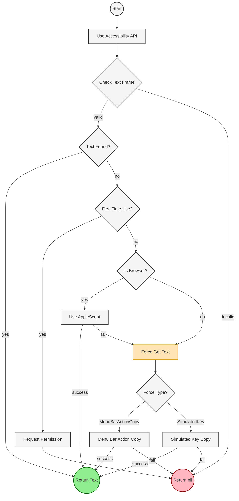

# Text Selection Flow

```mermaid
flowchart TD
    Start((Start)) --> CheckAX[Use Accessibility API]
    
    CheckAX --> CheckFrame{Check Text Frame}
    CheckFrame -->|valid| TextFound{Text Found?}
    CheckFrame -->|invalid| EndFail((Return nil))
    
    TextFound -->|yes| EndSuccess((Return Text))
    TextFound -->|no| FirstTime{First Time Use?}
    
    FirstTime -->|yes| RequestPerm[Request Permission]
    FirstTime -->|no| CheckBrowser{Is Browser?}
    
    RequestPerm --> EndFail
    
    CheckBrowser -->|yes| UseAS[Use AppleScript]
    CheckBrowser -->|no| ForceGet[Force Get Text]
    
    UseAS -->|success| EndSuccess
    UseAS -->|fail| ForceGet
    
    ForceGet --> CheckForceType{Force Type?}
    CheckForceType -->|MenuBarActionCopy| MenuCopy[Menu Bar Action Copy]
    CheckForceType -->|SimulatedKey| SimKey[Simulated Key Copy]
    
    MenuCopy -->|success| EndSuccess
    MenuCopy -->|fail| EndFail
    
    SimKey -->|success| EndSuccess
    SimKey -->|fail| EndFail

    classDef default fill:#f5f5f5,stroke:#333,stroke-width:2;
    classDef success fill:#90EE90,stroke:#006400;
    classDef failure fill:#FFB6C1,stroke:#8B0000;
    classDef force fill:#FFE4B5,stroke:#DAA520;
    
    class EndSuccess success;
    class EndFail failure;
    class ForceGet force;
```
