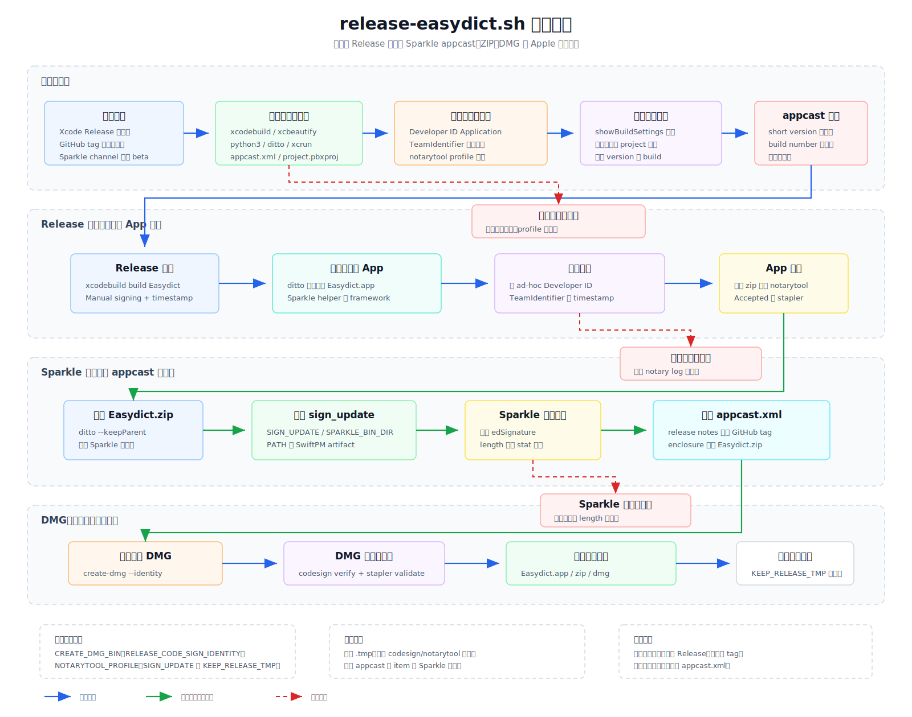

# 发布脚本

该目录保存 Easydict 的本地发布打包脚本。脚本只作为开发者工具
出现在 Xcode 导航器中，不加入应用构建阶段，也不会随 App 一起发布。

## 脚本

- `release-easydict.sh`：读取 Release 版本号，使用 Developer ID
  签名构建 `Easydict.app`，重签 Sparkle helper 与嵌入 framework，
  完成 notarization 和 stapling，打包 `Easydict.zip`，写入 Sparkle
  appcast 条目，并通过 `sindresorhus/create-dmg` 生成已签名和已
  notarize 的 `Easydict.dmg`。

## 发布流程

发布前先手动更新 `MARKETING_VERSION` 和 `CURRENT_PROJECT_VERSION`，
并确认钥匙串中存在脚本默认或环境变量指定的 Developer ID Application
证书。脚本默认使用 `RELEASE_DEVELOPMENT_TEAM=45Z6V4YD5U`、
`RELEASE_CODE_SIGN_IDENTITY=Developer ID Application: Canglong Dai
(45Z6V4YD5U)`、`RELEASE_NOTARY_TEAM_ID=45Z6V4YD5U`、
`NOTARYTOOL_PROFILE=easydict-release`、`CREATE_DMG_BIN=create-dmg` 和
`RELEASE_SPARKLE_CHANNEL=beta`。需要切换账号、凭据、Sparkle channel 或
命令路径时，通过环境变量覆盖；若要发布到默认稳定 channel，可运行时设置
`RELEASE_SPARKLE_CHANNEL=`。

脚本从 `xcodebuild -showBuildSettings` 读取版本信息，超时或失败时回退解析
`Easydict.xcodeproj/project.pbxproj` 中 `Easydict` target 的 Release 配置。
Sparkle 的 `sign_update` 会在 Release 构建完成后解析，按 `SIGN_UPDATE`、
`SPARKLE_BIN_DIR/sign_update`、PATH 中 `sign_update`、本次构建 DerivedData
中的 SwiftPM Sparkle artifact 顺序查找。脚本不再依赖迁移来源项目的本地
发布说明生成链路，新增 appcast 条目的 release notes 直接指向 GitHub tag
页面，下载 URL 指向 GitHub Releases 中的 `Easydict.zip`。

Developer ID 签名负责让 macOS 识别应用来源，`xcrun notarytool` 和
`xcrun stapler` 负责 Gatekeeper 校验，Sparkle 的 `sign_update` 只负责更新包
的 EdDSA 签名和 appcast 元数据。脚本会在构建前校验 notarytool profile、
Developer ID 证书、`create-dmg` 命令和 appcast 版本唯一性；Release 构建会
强制 `OTHER_CODE_SIGN_FLAGS=--timestamp`、`DEPLOYMENT_POSTPROCESSING=YES`
和 `ENABLE_DEBUG_DYLIB=NO`。执行完成后，根目录会生成被 `.gitignore` 忽略的
`Easydict.app`、`Easydict.zip` 和 `Easydict.dmg`，同时更新需要提交的
`appcast.xml`。

